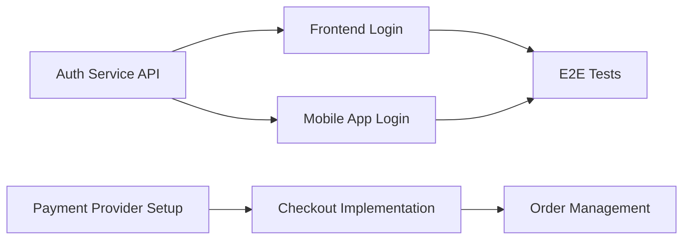

# Technical Project Management — Deep Reference

**Always use `WebSearch` to verify tool capabilities, framework versions, and methodology updates. PM tooling and delivery frameworks evolve rapidly. Last verified: April 2026.**

## Table of Contents
1. [Project Timelines and Roadmaps](#1-project-timelines-and-roadmaps)
2. [Dependency Mapping](#2-dependency-mapping)
3. [Risk Management](#3-risk-management)
4. [Milestone Tracking](#4-milestone-tracking)
5. [Stakeholder Communication](#5-stakeholder-communication)
6. [Resource Allocation](#6-resource-allocation)
7. [Project Estimation](#7-project-estimation)
8. [Delivery Metrics](#8-delivery-metrics)
9. [Technical Debt Management](#9-technical-debt-management)
10. [Cross-Team Coordination](#10-cross-team-coordination)
11. [Decision Frameworks](#11-decision-frameworks)
12. [PM Tools Comparison](#12-pm-tools-comparison)
13. [AI in Project Management](#13-ai-in-project-management)

---

## 1. Project Timelines and Roadmaps

### Roadmap Formats

| Format | Description | Best For | Weakness |
|--------|-------------|----------|----------|
| **Gantt Chart** | Time-based bars showing tasks, dependencies, and critical path | Waterfall, regulated, fixed-scope projects | Gives false precision, hard to maintain, invites micromanagement |
| **Now / Next / Later** | Three-column board without dates | Continuous delivery, startups, agile teams | Doesn't communicate dates to stakeholders who need them |
| **Timeline Roadmap** | Themes/epics on a quarterly timeline without exact dates | Growth-stage companies, product teams | Can still be mistaken for a commitment |
| **OKR-Based Roadmap** | Organized by objectives and key results, not features | Outcome-driven teams, product-led orgs | Requires mature OKR discipline |
| **Story Map Roadmap** | Jeff Patton's user story mapping across releases | MVP planning, new product development | Requires deep user journey understanding |

### Now / Next / Later Roadmap

The simplest and most honest roadmap format for agile teams:

```
NOW (this sprint/month — committed)
├── Feature: Checkout redesign
├── Tech debt: Migrate to PostgreSQL 16
└── Bug: Fix payment timeout on slow connections

NEXT (next 1-3 months — planned, not committed)
├── Feature: Multi-currency support
├── Feature: Order tracking API for partners
└── Infrastructure: CDN migration

LATER (3-6+ months — ideas, not planned)
├── Feature: Mobile app
├── Feature: AI-powered recommendations
└── Platform: Multi-region deployment
```

**Rules:**
- NOW items have assigned owners and sprint plans
- NEXT items have rough scope and dependencies identified
- LATER items are unscoped — they may change or be dropped
- Items move left as they get refined, never right without discussion

### OKR-Based Planning

**Structure:**
```
Objective: Reduce checkout friction
  KR1: Increase checkout completion rate from 62% to 78%
  KR2: Reduce average checkout time from 4.2 minutes to under 2 minutes
  KR3: Zero checkout-related P0 incidents

Initiatives (projects that drive the KRs):
  - Address autocomplete integration (drives KR1, KR2)
  - Saved payment methods (drives KR1, KR2)
  - Payment provider failover (drives KR3)
  - Performance optimization (drives KR2)
```

**OKR Cadence:**
- **Annual OKRs:** Company-level direction, high-level
- **Quarterly OKRs:** Team-level, measurable, drives sprint work
- **Mid-quarter check-in:** Score OKRs 0-1.0, adjust if needed
- **End-of-quarter review:** Score final results, feed into next quarter's planning

**Scoring:** 0.7-0.8 is "good" — if you consistently hit 1.0, your OKRs aren't ambitious enough.

### Quarterly Planning Process

**Week -2 to -1 (Prep):**
- Leadership shares company-level OKRs and strategic priorities
- Teams review previous quarter's results and carry-overs
- Engineering leads assess capacity (team size, planned PTO, holidays, known commitments)

**Planning Week:**
1. **Day 1:** Teams draft team-level OKRs aligned to company OKRs
2. **Day 2-3:** Cross-team dependency identification and resolution
3. **Day 4:** Final OKR presentation and alignment across teams
4. **Day 5:** Publish quarterly plan, set up tracking

**Throughout Quarter:**
- Weekly: Team-level progress tracking against OKRs
- Bi-weekly: Cross-team sync on shared dependencies
- Mid-quarter: Formal OKR check-in, adjust if needed
- End-of-quarter: Review, retro, feed into next cycle

---

## 2. Dependency Mapping

### Types of Dependencies

| Type | Description | Example | Risk Level |
|------|-------------|---------|------------|
| **Finish-to-Start** | Task B can't start until Task A finishes | API must be built before frontend integration | High — creates serial bottleneck |
| **Start-to-Start** | Task B can't start until Task A starts | Design and frontend can start together | Medium — coordination needed |
| **External** | Depends on a third party or external team | Waiting for vendor API access | Very high — limited control |
| **Knowledge** | Depends on specific person's expertise | Only one person knows the legacy system | High — bus factor risk |
| **Infrastructure** | Depends on environment or tooling | CI pipeline must be set up first | Medium — usually parallelizable |

### Dependency Visualization Techniques

**Dependency Matrix:**
```
             Team A   Team B   Team C   Vendor
Team A         —       2→       —        1→
Team B         —       —        3→       —
Team C         1→      —        —        —
Vendor         —       —        —        —

Numbers = count of dependencies, → = depends on
```

**Dependency Graph (Mermaid):**


### Managing Dependencies

**Prevention:**
- Design systems with loose coupling (APIs, contracts, events) to minimize dependencies
- Use contract-first development — agree on API contracts before implementation begins
- Break work so each team can ship independently as much as possible

**Detection:**
- Explicitly ask about dependencies during backlog refinement
- Review dependencies in sprint planning: "What do we need from other teams?"
- Map dependencies during quarterly planning using a dependency board

**Mitigation:**
- **Stubs/mocks:** Build against API contracts, mock the dependency until it's ready
- **Feature flags:** Ship behind a flag, enable when the dependency delivers
- **Parallel development:** Agree on the contract, build both sides simultaneously
- **Buffer:** Add 20-30% buffer for stories with external dependencies
- **Escalation path:** Define who resolves cross-team blockers and how fast

### Cross-Team Dependency Ceremonies

| Ceremony | Cadence | Purpose |
|----------|---------|---------|
| **Scrum of Scrums** | 2-3x per week | Identify and resolve cross-team blockers |
| **Big Room Planning** (SAFe PI Planning) | Quarterly | Map dependencies across all teams for the quarter |
| **Dependency standup** | Weekly | Quick sync on shared dependency status |
| **Integration demo** | End of sprint | Verify cross-team integration points work |

---

## 3. Risk Management

### Risk Register Template

| ID | Risk | Category | Likelihood (1-5) | Impact (1-5) | Score | Owner | Mitigation | Status |
|----|------|----------|-------------------|-------------|-------|-------|------------|--------|
| R1 | Vendor API delayed | External | 4 | 5 | 20 | TPM | Build mock API, parallel frontend work | Open |
| R2 | Key engineer leaves | Resource | 2 | 4 | 8 | EM | Cross-train, document knowledge | Monitoring |
| R3 | Performance regression | Technical | 3 | 3 | 9 | Tech Lead | Add perf benchmarks to CI | Mitigated |

### Risk Matrix

```
Impact →    1-Minimal  2-Minor   3-Moderate  4-Major   5-Critical
Likelihood ↓
5-Almost certain   5       10        15         20        25
4-Likely           4        8        12         16        20
3-Possible         3        6         9         12        15
2-Unlikely         2        4         6          8        10
1-Rare             1        2         3          4         5

Score interpretation:
  1-4:   Accept (monitor)
  5-9:   Mitigate (plan response)
  10-15: Mitigate actively (assign owner, track weekly)
  16-25: Escalate (executive awareness, contingency plan)
```

### RAID Log

RAID = **R**isks, **A**ssumptions, **I**ssues, **D**ependencies

| Type | Item | Status | Owner | Action Required | Due Date |
|------|------|--------|-------|-----------------|----------|
| **Risk** | Third-party API may not support batch operations | Open | Backend Lead | Spike to validate, prepare fallback | Sprint 4 |
| **Assumption** | Design system components are reusable across features | Validated | Frontend Lead | Confirmed with design team | — |
| **Issue** | CI pipeline is flaky — 15% false failure rate | Active | DevOps | Investigating root cause, tracking in issue #342 | Sprint 3 |
| **Dependency** | Mobile team needs Push Notification service from Platform | Blocked | TPM | Meeting scheduled with Platform team Thursday | Sprint 3 |

**When to use RAID vs Risk Register:**
- **RAID log:** When you need a lightweight, single document tracking all project concerns. Good for small-to-medium projects.
- **Risk register:** When risk management needs to be more formal — regulated environments, large programs, or when risks need probabilistic assessment.

### Risk Review Cadence

| Project Size | Review Cadence | Who Attends |
|-------------|---------------|-------------|
| Small (1 team) | During sprint review | Team + PO |
| Medium (2-5 teams) | Weekly, dedicated 15 min | Tech leads + TPM |
| Large (5+ teams) | Weekly risk review + bi-weekly exec update | TPMs + program manager + engineering directors |

---

## 4. Milestone Tracking

### Defining Good Milestones

Milestones should be:
- **Outcome-based**, not task-based: "Users can make purchases" not "Checkout code complete"
- **Objectively verifiable** — you can demonstrate it working
- **Meaningful to stakeholders** — represents real progress they care about
- **Spaced 2-6 weeks apart** — frequent enough to course-correct, infrequent enough to be meaningful

### Milestone Template

```
Milestone: Users can complete end-to-end purchase
Target Date: March 15, 2026
Confidence: 🟢 High (85%)

Prerequisites:
  ✅ Product catalog API live
  ✅ Cart functionality complete
  🔄 Payment integration (in progress, on track)
  ⬜ Order confirmation flow (starting next sprint)

Risks:
  - Payment provider sandbox has intermittent issues (mitigation: local mock)

Demo Criteria:
  - New user can browse products, add to cart, pay, and receive confirmation
  - Works on desktop and mobile web
  - Handles payment failures gracefully

Dependencies:
  - Payment provider sandbox access (received)
  - Design review for confirmation page (scheduled)
```

### Earned Value Management (EVM)

For projects with fixed scope and budget (less common in agile, but useful for funded initiatives):

| Metric | Formula | What It Tells You |
|--------|---------|-------------------|
| **Planned Value (PV)** | Budget allocated for work planned to date | How much work should be done by now |
| **Earned Value (EV)** | Budget allocated for work actually completed | How much work is actually done |
| **Actual Cost (AC)** | Real cost spent to date | How much has been spent |
| **Schedule Variance (SV)** | EV - PV | Positive = ahead, negative = behind |
| **Cost Variance (CV)** | EV - AC | Positive = under budget, negative = over budget |
| **Schedule Performance Index (SPI)** | EV / PV | > 1.0 = ahead, < 1.0 = behind |
| **Cost Performance Index (CPI)** | EV / AC | > 1.0 = under budget, < 1.0 = over budget |

**In agile terms:** EV can be approximated using story points completed vs planned at each checkpoint.

---

## 5. Stakeholder Communication

### RACI Matrix

| Activity | Engineering Lead | Product Manager | Design | QA | TPM | VP Engineering |
|----------|-----------------|-----------------|--------|-----|-----|----------------|
| Sprint planning | **R** | **A** | C | C | I | — |
| Architecture decisions | **R/A** | I | — | — | I | I |
| Release decision | C | **A** | — | **R** | C | I |
| Status reporting | C | I | — | — | **R/A** | I |
| Roadmap updates | C | **R/A** | C | — | C | **A** |

**R** = Responsible (does the work), **A** = Accountable (owns the outcome), **C** = Consulted, **I** = Informed

### Status Report Templates

**Weekly Engineering Status (for engineering leadership):**

```
## Sprint 14 — Week 1 of 2
**Sprint Goal:** Users can complete checkout with saved payment methods
**Status:** 🟢 On Track

### Progress
- Payment method API endpoints complete and tested
- Saved cards UI component in review
- 5 of 8 committed stories done (62.5%)

### Blockers
- None currently

### Risks
- Payment provider rate limit may impact load testing (mitigation: scheduled for off-peak)

### Key Metrics
- Velocity trend: 32 → 30 → 34 → 31 (stable)
- Cycle time (p85): 3.2 days
- WIP: 4 items (target: ≤ 5)

### Next Week Focus
- Checkout flow integration testing
- Address autocomplete implementation begins
```

**Executive Status (for non-technical stakeholders):**

```
## Project: Checkout Redesign — April Update
**Status:** 🟢 On Track | **Target:** June 2026 launch

### Summary
Checkout redesign is progressing well. Users can now browse, add to cart,
and pay using saved payment methods in our staging environment. On track
for June launch.

### Highlights
- Saved payment methods feature complete — reduces checkout to 2 clicks
- Performance: checkout load time reduced from 3.4s to 1.1s
- 3 of 5 milestones complete, Milestone 4 begins next week

### Risks & Mitigations
- Multi-currency support requires additional payment provider work
  → Scoped to USD/EUR for launch, other currencies in follow-up

### Timeline
M1 ✅ Cart redesign (Feb) | M2 ✅ Payment integration (Mar)
M3 ✅ Saved methods (Apr) | M4 🔄 Order tracking (May)
M5 ⬜ Launch (Jun)
```

### Communication Cadence

| Audience | Format | Cadence | Content |
|----------|--------|---------|---------|
| **Engineering team** | Standup + sprint board | Daily | Blockers, progress, WIP |
| **Product/Design** | Sprint review | Every sprint | Demo, metrics, feedback |
| **Engineering leadership** | Written status + 15 min sync | Weekly | Progress, risks, metrics, blockers |
| **Executive leadership** | Written update + dashboard | Bi-weekly or monthly | Summary, milestones, risks, timeline |
| **External stakeholders** | Email update or slide | Monthly or milestone-based | Highlights, timeline, asks |

---

## 6. Resource Allocation

### Capacity Planning Across Projects

**Allocation models:**

| Model | How It Works | Pros | Cons |
|-------|-------------|------|------|
| **Dedicated teams** | Each team owns a project/product area | Deep context, team cohesion, clear ownership | Idle time if work runs out, hard to rebalance |
| **Percentage allocation** | Engineers split time: 70% Project A, 30% Project B | Flexible, covers multiple priorities | Context switching kills productivity, nobody owns anything |
| **Sprint rotation** | Team works on Project A this sprint, Project B next sprint | Focused work periods, no context switching within a sprint | Slow response time for each project, requires good handoffs |

**Recommendation:** Dedicated teams whenever possible. Percentage allocation is almost always worse than it looks on paper — the context-switching cost is higher than the "flexibility" benefit.

### Skills Matrix

Map team capabilities to identify coverage gaps and cross-training needs:

```
               Frontend  Backend  DevOps  Database  Mobile  ML
Engineer A        ★★★      ★★       ★        ★       —      —
Engineer B        ★         ★★★     ★★       ★★      —      —
Engineer C        ★★        ★★      ★★★      ★       —      —
Engineer D        ★★★       ★       —        —       ★★★    —
Engineer E        —         ★★      ★        ★★★     —      ★★

★★★ = Expert  ★★ = Proficient  ★ = Can contribute  — = No experience
```

**Red flags:**
- Any column with only one ★★★ (bus factor of 1)
- Any row that's all ★ or — (specialist without breadth)
- Any column with no ★★★ (capability gap)

### Team Topologies

| Topology | Purpose | Interaction Mode |
|----------|---------|-----------------|
| **Stream-aligned** | Delivers value directly to users/customers | Primary team type — most teams should be this |
| **Platform** | Provides internal services that accelerate stream-aligned teams | X-as-a-Service — stream teams consume their APIs (Gartner: 80% of large engineering orgs will have platform teams by 2026) |
| **Enabling** | Helps stream-aligned teams adopt new capabilities | Facilitation — coaching, training, then stepping back |
| **Complicated subsystem** | Owns a complex domain requiring deep specialization | Collaboration — works closely with stream teams |

---

## 7. Project Estimation

### PERT Estimation

**Three-Point Estimation:**
```
Optimistic (O): Best case, everything goes right
Most Likely (M): Realistic scenario
Pessimistic (P): Worst case, things go wrong

Expected = (O + 4M + P) / 6
Standard Deviation = (P - O) / 6
```

**Example:**
```
Feature: Payment integration
  Optimistic: 2 weeks (clean API, good docs)
  Most Likely: 4 weeks (some edge cases, testing)
  Pessimistic: 8 weeks (API issues, compliance requirements)

  Expected: (2 + 16 + 8) / 6 = 4.3 weeks
  StdDev: (8 - 2) / 6 = 1.0 week

  68% confidence: 3.3 - 5.3 weeks
  95% confidence: 2.3 - 6.3 weeks
```

### Reference Class Forecasting

Instead of estimating from scratch, compare to similar completed projects:

1. **Identify the reference class** — find 5-10 similar projects the team has completed
2. **Collect actual durations** — how long did they actually take?
3. **Adjust for differences** — what's different about this project?
4. **Use the distribution** — provide a range, not a point estimate

**Proven results:** UK infrastructure projects reduced average cost overruns from 38% to 5% after adopting reference class forecasting. It's one of the most effective debiasing techniques available.

**Example:** "Our last 5 API integrations took 3, 4, 4, 6, and 8 weeks. Median is 4 weeks. This integration is moderately complex (similar to the 4-week ones), but we have a new vendor. Estimate: 4-6 weeks."

### Cone of Uncertainty

Estimation accuracy improves as the project progresses:

| Project Phase | Estimation Accuracy |
|---------------|-------------------|
| Initial concept | 0.25x to 4.0x (16x range) |
| Requirements approved | 0.5x to 2.0x (4x range) |
| Design complete | 0.67x to 1.5x (2.25x range) |
| Code complete | 0.8x to 1.25x (1.56x range) |

**Key insight:** Early estimates are inherently inaccurate. Don't commit to fixed dates based on concept-phase estimates. Narrow the cone by doing spikes, prototypes, and incremental delivery.

---

## 8. Delivery Metrics

### DORA Metrics

The four key metrics of software delivery performance:

| Metric | Elite | High | Medium | Low |
|--------|-------|------|--------|-----|
| **Deployment Frequency** | On-demand (multiple per day) | Weekly to monthly | Monthly to every 6 months | Every 6+ months |
| **Lead Time for Changes** | < 1 hour (as low as 15 min with modern CI/CD) | 1 day to 1 week | 1 week to 1 month | 1-6 months |
| **Mean Time to Recovery (MTTR)** | < 1 hour (top performers: ~7 min with automated recovery) | < 1 day | 1 day to 1 week | 1 week to 1 month |
| **Change Failure Rate** | 0-15% (elite: < 0.5%) | 16-30% | 16-30% | 46-60% |

Elite performers are 973x more likely to deploy on demand and 6,570x faster at recovering from incidents than low performers.

**How to measure:**
- **Deployment Frequency:** Count production deployments per week/month
- **Lead Time:** Measure from first commit to production deployment
- **MTTR:** Time from incident detection to resolution
- **Change Failure Rate:** % of deployments that require rollback or hotfix

**Tools:** DORA-native dashboards in LinearB, Jellyfish, Sleuth, Faros AI, Swarmia; or build custom from CI/CD pipeline data.

### Value Stream Mapping

Map the flow of work from idea to production to identify waste:

```
Idea → Backlog → Refinement → Sprint Planning → Development → Code Review → QA → Staging → Production
 ↓        ↓          ↓              ↓                ↓            ↓         ↓      ↓          ↓
2 wks    3 days     1 hr          1 hr             3 days       1 day     2 days  4 hrs      5 min
         (wait)                                    (active)     (wait)   (wait)             
```

**Look for:**
- **Wait times** — work sitting in queues (code review backlog, QA queue, deployment window)
- **Handoff delays** — time lost passing work between people or teams
- **Rework loops** — stories bounced back from QA or review
- **Flow efficiency** — active work time / total lead time (most teams are 15-30% efficient)

---

## 9. Technical Debt Management

### Tracking Technical Debt

**Categorize debt:**

| Category | Description | Example | Urgency |
|----------|-------------|---------|---------|
| **Deliberate prudent** | Conscious tradeoff for speed | "We'll use a simpler auth for MVP" | Planned paydown |
| **Deliberate reckless** | Knowing it's wrong but doing it anyway | "We don't have time for tests" | High — creates compounding risk |
| **Inadvertent prudent** | Learned a better approach after the fact | "Now that we understand the domain, this model is wrong" | Medium — refactor when touching the code |
| **Inadvertent reckless** | Didn't know better | Junior engineer wrote spaghetti code | Medium-high — code review missed it |

### Prioritization Frameworks

**Interest rate model:** Prioritize debt that "charges the highest interest" — the debt that slows down the most work, causes the most bugs, or blocks the most features.

**Allocation strategies:**

| Strategy | How It Works | Best For |
|----------|-------------|----------|
| **20% rule** | Reserve 20% of each sprint for tech debt | Steady, continuous debt reduction |
| **Tech debt sprints** | Dedicate entire sprints to debt (every 4-6 sprints) | Large refactoring efforts |
| **Boy Scout rule** | Leave code better than you found it — fix debt as you touch code | Small, incremental improvement |
| **Risk-based** | Fix debt that poses the highest production risk first | Teams with stability issues |
| **Feature-adjacent** | Fix debt in areas you're building features in | Practical — debt reduction happens where it matters most |

### Communicating Tech Debt to Non-Technical Stakeholders

Don't say "we need to refactor the authentication module." Say:

- "Login takes 4 seconds because of how it's built. Fixing this will reduce it to under 1 second and prevent outages like last month's."
- "We can build Feature X in 3 sprints on top of the current code, or we can spend 1 sprint fixing the foundation and then build Feature X in 1 sprint."
- "The payment system has a known bug that affects 2% of transactions. Every sprint we delay fixing it costs us approximately $X in failed payments."

Frame debt in terms of: speed (how it slows future work), risk (what can break), and cost (money, users, or reputation at stake).

---

## 10. Cross-Team Coordination

### Scaled Frameworks Comparison

| Framework | Best For | Key Mechanism | Ceremony Overhead | Flexibility |
|-----------|----------|--------------|-------------------|-------------|
| **SAFe (Scaled Agile Framework)** | Large enterprises (50-200+ engineers) | PI Planning (quarterly), Agile Release Train | Very high | Low (prescriptive) |
| **LeSS (Large-Scale Scrum)** | 2-8 teams, keeping it simple | Shared Product Backlog, multi-team refinement | Low | High (minimalist) |
| **Nexus** | 3-9 teams building a single product | Nexus Integration Team, cross-team refinement | Medium | Medium |
| **Spotify Model** | Engineering culture-focused orgs | Squads, tribes, chapters, guilds | Low (informal) | Very high (cultural, not prescriptive) |
| **Flight Levels** | Any size, focuses on flow across levels | Strategic, coordination, and operational levels | Varies | High (meta-framework) |
| **Team Topologies** | Designing team structures for flow | Stream-aligned, platform, enabling, complicated-subsystem teams | N/A (structural, not ceremonial) | High |

### SAFe PI Planning (Quarterly)

**Structure (2-day event for 50-125+ people):**

Day 1:
1. Business context + vision (executive leadership)
2. Architecture vision (system architect)
3. Team breakouts — draft iteration plans, identify dependencies
4. Draft plan review — teams present plans, dependencies visible

Day 2:
1. Planning adjustments based on Day 1 feedback
2. Final plan review + confidence vote (fist of five)
3. Risks and impediments identified for the PI
4. Program board published (features, dependencies, milestones)

### Lightweight Coordination (Without a Framework)

For teams that don't need a full scaled framework:

1. **Weekly cross-team sync** (30 min): Each team lead shares progress, blockers, and upcoming dependencies
2. **Shared dependency board**: Visible to all teams, updated daily
3. **Integration demo** every 2 weeks: Cross-team working software demo
4. **Quarterly planning** workshop: 2-4 hours, all leads, map quarterly priorities and dependencies
5. **Slack/Teams channel** for cross-team coordination: Real-time, async blocker resolution

---

## 11. Decision Frameworks

### Architecture Decision Records (ADRs)

See `technical-writer` skill for detailed ADR templates and tooling. Key guidance for PMs:

- ADRs should be written BEFORE or DURING implementation, not after
- Every significant technical decision should have an ADR
- Review ADRs every 6-12 months — supersede when decisions change
- Store alongside code in version control

### RFC Process

For decisions requiring broader input:

```
1. Author writes RFC document (problem, proposed solution, alternatives)
2. RFC shared with relevant stakeholders (2-5 day comment period)
3. Author addresses comments, revises proposal
4. Decision maker (tech lead, architect) approves or requests changes
5. RFC becomes the record of the decision
```

**When to use RFC vs ADR:**
- **ADR:** Team-level decisions, quick turnaround (1-2 days)
- **RFC:** Cross-team decisions, architecture changes, significant investments (1-2 weeks)

### Decision Matrix

For evaluating multiple options against weighted criteria:

```
Criteria (weight)         | Option A | Option B | Option C
Performance (5)           |    8     |    6     |    9
Developer experience (4)  |    9     |    7     |    5
Maintenance cost (3)      |    7     |    8     |    6
Time to implement (4)     |    6     |    9     |    4
Community/ecosystem (2)   |    8     |    6     |    7

Weighted score:           |   138    |   131    |   113
```

Use this when the decision involves multiple stakeholders with different priorities. The weighting makes priorities explicit and the math makes tradeoffs visible.

---

## 12. PM Tools Comparison

### Feature Comparison (2026)

| Feature | Jira | Linear | Shortcut | Asana | Monday.com | GitHub Projects |
|---------|------|--------|----------|-------|------------|-----------------|
| **Sprint planning** | Full (board, backlog, velocity) | Cycles (clean, fast) | Iterations | Sprint-like with timeline | Sprint views | Custom workflows |
| **Roadmap** | Advanced Roadmap (Premium) | Roadmap view | Milestones + roadmap | Timeline + Portfolio | Timeline | Roadmap view |
| **Dependencies** | Native linking + Advanced | Issue relations | Story links | Dependencies | Dependencies | Task links |
| **Analytics** | Advanced (velocity, burndown, CFD) | Cycle analytics, insights | Velocity, cycle time | Workload, reporting | Dashboards | Basic (custom views) |
| **API / Integrations** | Extensive | Good, growing | Good | Extensive | Extensive | Native GitHub ecosystem |
| **AI features** | Atlassian Intelligence | Built-in AI | Limited | Asana AI | Monday AI | Copilot for Issues |
| **Best for** | Enterprise, SAFe | Engineering-focused teams | Balance of features | Cross-functional teams | Non-technical PM teams | Open source, GitHub-native |
| **Price** | Free (10 users) → $$$$ | $8/user/month | $8.50/user/month | Free → $$$$ | $9/user/month → $$$$ | Free with GitHub |

---

## 13. AI in Project Management

### Current AI Capabilities (2026)

| Category | What AI Can Do | What It Can't Do |
|----------|---------------|-----------------|
| **Status reporting** | Auto-generate status reports from ticket data, PR activity, and deployment logs | Understand context behind delays or assess team morale |
| **Estimation** | Suggest estimates based on historical data for similar work | Account for team-specific dynamics or novel technical challenges |
| **Risk detection** | Flag stale PRs, long-running stories, dependency conflicts | Assess organizational/political risks or interpersonal dynamics |
| **Forecasting** | Monte Carlo simulations, trend analysis, predictive completion dates | Handle scope changes or strategy pivots that invalidate historical patterns |
| **Meeting prep** | Summarize tickets, PRs, and discussions before standups/reviews | Replace the human judgment in facilitation |
| **Backlog management** | Identify duplicate tickets, suggest groupings, auto-label | Make prioritization decisions that require business context |

### Tools Using AI for PM (2026)

| Tool | AI Feature | Value |
|------|-----------|-------|
| **Jira (Atlassian Intelligence)** | Auto-summarize issues, suggest related tickets, smart queries | Saves time on triage and search |
| **Linear** | AI issue creation from Slack, auto-labeling, natural language search | Reduces friction for capturing and finding work |
| **Jellyfish** | Engineering investment allocation, delivery forecasting | Executive-level visibility into engineering efficiency |
| **LinearB** | DORA metrics automation, PR cycle time analysis, code review analytics | Developer productivity visibility |
| **Swarmia** | Developer experience insights, engineering metrics, investment tracking | Connects engineering work to business outcomes |
| **Allstacks** | Predictive delivery analytics, risk scoring | Forecasting and risk identification |

### Using AI Effectively in PM

**Do:**
- Use AI to automate status report drafts — but review and add context before sending
- Use AI-generated estimates as input to team discussions, never as the final answer
- Leverage AI analytics to spot trends the team might miss (velocity drops, cycle time increases)
- Automate tedious PM tasks: ticket deduplication, label management, sprint report generation

**Don't:**
- Let AI make prioritization decisions without human review
- Trust AI risk assessments for novel situations (it extrapolates from patterns, not understanding)
- Skip 1:1 conversations because "the data shows" — numbers don't capture everything
- Use AI-generated metrics as performance evaluation of individuals
