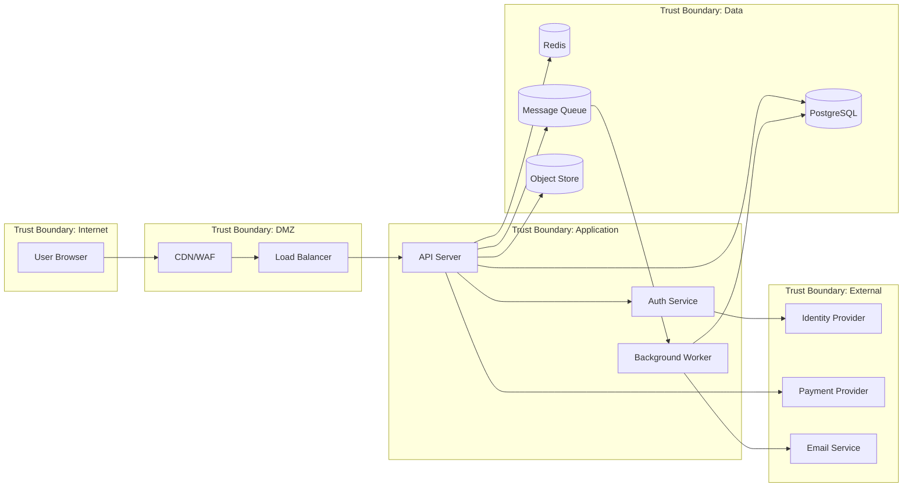

# Security Review — Deep Reference

**Always use `WebSearch` to verify current CVSS scores, MITRE ATT&CK updates, CIS Benchmark versions, tool releases, and vulnerability data before giving advice. Threat landscapes evolve daily.**

## Table of Contents
1. [Threat Modeling Methodologies](#1-threat-modeling-methodologies)
2. [Security Architecture Review](#2-security-architecture-review)
3. [Penetration Testing](#3-penetration-testing)
4. [Vulnerability Assessment and Prioritization](#4-vulnerability-assessment-and-prioritization)
5. [Security Code Review](#5-security-code-review)
6. [Cloud Security Assessment](#6-cloud-security-assessment)
7. [Attack Surface Management](#7-attack-surface-management)
8. [Red Team / Blue Team / Purple Team](#8-red-team--blue-team--purple-team)
9. [MITRE ATT&CK Framework](#9-mitre-attck-framework)
10. [AI and LLM Security](#10-ai-and-llm-security)
11. [Security Design Patterns](#11-security-design-patterns)
12. [Incident Preparedness](#12-incident-preparedness)
13. [Security Review Selection Framework](#13-security-review-selection-framework)

---

## 1. Threat Modeling Methodologies

### Methodology Comparison

| Method | Focus | Best For | Complexity | Output |
|--------|-------|----------|-----------|--------|
| **STRIDE** | Threats by category | Software systems, features | Low-Medium | Threat list by category |
| **PASTA** | Risk-centric, business context | Full applications, compliance | High | Risk-ranked threat list with attack trees |
| **LINDDUN** | Privacy threats | Privacy-sensitive systems, GDPR | Medium | Privacy threat catalog |
| **VAST** | Visual, agile-integrated | Large-scale, DevSecOps | Medium | Threat model diagrams per feature |
| **Attack Trees** | Specific attack scenarios | Focused analysis of one goal | Low | Tree of attack paths |
| **OCTAVE** | Organizational risk | Enterprise risk assessment | High | Risk profiles and strategies |

### STRIDE Threat Modeling

STRIDE categorizes threats by what the attacker is trying to achieve:

| Category | Threat | Violated Property | Example | Typical Mitigations |
|----------|--------|-------------------|---------|---------------------|
| **S** — Spoofing | Pretending to be someone else | Authentication | Stolen credentials, forged tokens | MFA, strong AuthN, certificate pinning |
| **T** — Tampering | Modifying data or code | Integrity | SQL injection, request manipulation | Input validation, signing, checksums |
| **R** — Repudiation | Denying an action occurred | Non-repudiation | Deleting audit logs, anonymous actions | Audit logging, digital signatures, timestamps |
| **I** — Information Disclosure | Exposing data to unauthorized parties | Confidentiality | Data breach, verbose error messages | Encryption, access control, data classification |
| **D** — Denial of Service | Making system unavailable | Availability | DDoS, resource exhaustion, infinite loops | Rate limiting, WAF, auto-scaling, circuit breakers |
| **E** — Elevation of Privilege | Gaining unauthorized access | Authorization | Broken access control, privilege escalation | Least privilege, RBAC/ABAC, input validation |

### STRIDE Threat Modeling Process

```
Step 1: Define the system
  → Draw a data flow diagram (DFD) with:
     - External entities (users, third-party services)
     - Processes (application components)
     - Data stores (databases, caches, file systems)
     - Data flows (arrows between components)
     - Trust boundaries (dotted lines separating trust zones)

Step 2: Identify threats (per element)
  → For each element in the DFD, ask STRIDE questions:
     - External entity: Spoofing, Repudiation
     - Process: All six STRIDE categories
     - Data store: Tampering, Information Disclosure, Denial of Service
     - Data flow: Tampering, Information Disclosure, Denial of Service

Step 3: Rate threats
  → Use DREAD or risk matrix (Likelihood × Impact)
  → Focus on high-impact, high-likelihood threats first

Step 4: Plan mitigations
  → For each threat, define controls (preventive, detective, responsive)
  → Map to existing controls — identify gaps

Step 5: Validate
  → Review with dev team, security team, and stakeholders
  → Update when architecture changes
```

### Threat Model DFD Example (Mermaid)



### PASTA Threat Modeling (Process for Attack Simulation and Threat Analysis)

Seven stages of PASTA:

| Stage | Activity | Output |
|-------|----------|--------|
| **1. Define objectives** | Business impact analysis, compliance requirements | Risk profile, business context |
| **2. Define technical scope** | Application architecture, data flows, technology stack | Technical scope document |
| **3. Application decomposition** | Identify components, trust boundaries, entry points | DFD, attack surface map |
| **4. Threat analysis** | Research relevant threats (CVE databases, threat intel) | Threat library |
| **5. Vulnerability analysis** | Correlate threats with known vulnerabilities | Vulnerability matrix |
| **6. Attack modeling** | Build attack trees for high-risk scenarios | Attack trees, simulation results |
| **7. Risk and impact analysis** | Quantify risk, prioritize mitigations | Ranked risk list, mitigation plan |

### Automated Threat Modeling Tools

| Tool | Approach | Pricing | Best For |
|------|---------|---------|----------|
| **Microsoft Threat Modeling Tool** | STRIDE-based, DFD templates | Free | Microsoft ecosystem, simple models |
| **OWASP Threat Dragon** | STRIDE, DFD-based, open source | Free | Open-source, cross-platform |
| **IriusRisk** | Automated threat generation from architecture | Commercial | Enterprise, CI/CD integrated |
| **Threagile** | Code-based threat model (YAML → report) | Open source | DevSecOps, code-first approach |
| **CAIRIS** | Requirements-driven, UML-integrated | Open source | Research, complex systems |

### Threagile Example (Code-Based Threat Modeling)

```yaml
# threagile.yaml - Define architecture, get automated threat analysis
title: My Application
technical_assets:
  api-server:
    type: process
    technology: go
    internet: false
    machine: container
    encryption: none
    owner: backend-team
    confidentiality: confidential
    integrity: critical
    availability: critical
    data_assets_processed:
      - customer-data
      - auth-tokens
    communication_links:
      postgres-db:
        target: postgres
        protocol: postgresql
        authentication: credentials
        encryption: none  # Will flag as threat!

  postgres:
    type: datastore
    technology: database
    data_assets_stored:
      - customer-data

data_assets:
  customer-data:
    confidentiality: confidential
    integrity: critical
    quantity: many

# Run: threagile -model threagile.yaml
# Generates: HTML/PDF report with identified threats, risk ratings, mitigations
```

---

## 2. Security Architecture Review

### Review Checklist Framework

| Area | Questions to Ask | What to Look For |
|------|-----------------|-----------------|
| **Authentication** | How do users authenticate? Is MFA enforced? How are sessions managed? | Weak auth mechanisms, missing MFA, long-lived sessions |
| **Authorization** | What access control model? How are permissions checked? | Missing authZ checks, excessive privileges, IDOR vulnerabilities |
| **Data Protection** | What data is sensitive? Encrypted at rest and in transit? | Unencrypted data, missing TLS, plaintext secrets |
| **Network Security** | What are the trust boundaries? How is traffic filtered? | Flat networks, missing segmentation, open ports |
| **Input Validation** | Where is user input accepted? How is it validated? | Missing validation, injection points, file upload risks |
| **Logging & Monitoring** | What is logged? Are security events alerted on? | Missing audit trail, insufficient monitoring, alert fatigue |
| **Secret Management** | Where are secrets stored? How are they rotated? | Hardcoded secrets, missing rotation, long-lived credentials |
| **Dependency Management** | How are dependencies tracked? Vulnerability scanning? | Outdated deps, missing SCA, no SBOM |
| **Deployment Security** | How is code deployed? Who has production access? | Manual deploys, excessive access, missing approval gates |
| **Incident Response** | Is there a plan? Are runbooks current? | No IR plan, untested procedures, missing contacts |

### Security Architecture Review Template

```markdown
# Security Architecture Review: [System Name]

## Overview
- **System**: [Brief description]
- **Reviewer**: [Name]
- **Date**: [Date]
- **Architecture Version**: [Version/Commit]

## Risk Summary
| Risk | Severity | Status |
|------|----------|--------|
| [Finding 1] | Critical/High/Medium/Low | Open/Mitigated/Accepted |

## Architecture Analysis

### Data Flow
[Mermaid DFD or description]

### Trust Boundaries
[Where do trust levels change?]

### Authentication & Authorization
[How are users/services authenticated? How is access controlled?]

### Data Protection
[Encryption, classification, handling]

### Network Security
[Segmentation, firewall rules, exposure]

## Findings

### [FINDING-001] [Title]
- **Severity**: Critical/High/Medium/Low
- **Category**: STRIDE category
- **Description**: [What was found]
- **Impact**: [What could happen if exploited]
- **Recommendation**: [How to fix]
- **Reference**: [CWE, OWASP, etc.]

## Recommendations Summary
[Prioritized list of actions]
```

---

## 3. Penetration Testing

### Methodologies

| Methodology | Scope | Focus | Standard |
|------------|-------|-------|----------|
| **OWASP Testing Guide v5** | Web applications | Comprehensive web app testing | OWASP |
| **PTES** | General penetration testing | End-to-end pentest framework | Open standard |
| **NIST SP 800-115** | Technical security testing | Federal/regulated environments | NIST |
| **OSSTMM** | All systems | Operational security testing | ISECOM |
| **CREST** | Professional pentesting | Certification-aligned methodology | CREST |

### Pentest Types

| Type | Scope | Knowledge | Duration | Cost |
|------|-------|-----------|----------|------|
| **Black box** | External attack simulation | No prior knowledge | 1-3 weeks | $$$ |
| **Gray box** | Authenticated testing | Some documentation, credentials | 1-2 weeks | $$ |
| **White box** | Full code + architecture review | Full source code and docs | 2-4 weeks | $$$$ |
| **Red team** | Full-scope adversary simulation | Defined objectives, any tactics | 4-12 weeks | $$$$$ |

### Penetration Testing Tools

| Tool | Purpose | License | Best For |
|------|---------|---------|----------|
| **Burp Suite Professional** | Web app testing proxy | Commercial ($449/yr) | Manual + automated web testing |
| **Caido** | Modern web testing proxy | Free + paid | Modern Burp alternative, Rust-based |
| **Nuclei** | Template-based scanning | Open source | Large-scale automated scanning |
| **Metasploit** | Exploitation framework | Open source + Pro | Exploitation, post-exploitation |
| **Nmap** | Network discovery and scanning | Open source | Port scanning, service detection |
| **ffuf** | Web fuzzing | Open source | Directory brute-forcing, parameter fuzzing |
| **SQLMap** | SQL injection | Open source | Automated SQL injection testing |
| **Hashcat** | Password cracking | Open source | Credential testing (authorized) |

### Bug Bounty Platforms

| Platform | Programs | Payout Range | Best For |
|----------|----------|-------------|----------|
| **HackerOne** | 3000+ (including US DoD) | $100 — $250K+ | Largest platform, enterprise programs |
| **Bugcrowd** | 1000+ | $100 — $100K+ | Managed programs, strong triage |
| **Intigriti** | 500+ (EU-focused) | $100 — $100K+ | European programs, GDPR-aware |
| **Synack** | Curated researchers only | Varies | High-security, vetted researchers |

### Bug Bounty Program Design

```
1. Define scope clearly
   ├── In-scope: production domains, API endpoints, mobile apps
   ├── Out-of-scope: staging, employee accounts, social engineering
   └── Safe harbor: promise not to pursue legal action for good-faith testing

2. Set severity-based payouts
   ├── Critical (RCE, auth bypass, data breach): $5K - $50K+
   ├── High (stored XSS, IDOR, privilege escalation): $1K - $10K
   ├── Medium (reflected XSS, info disclosure): $250 - $2K
   └── Low (security header missing, verbose errors): $50 - $500

3. Define response SLAs
   ├── Acknowledgment: 24 hours
   ├── Triage: 3 business days
   ├── Bounty decision: 10 business days
   └── Resolution: severity-based (critical: 7 days, high: 30 days)

4. Run a private program first (invited researchers only)
   Then open to public after you've fixed the low-hanging fruit
```

---

## 4. Vulnerability Assessment and Prioritization

### CVSS v4.0 Quick Reference

**Base Score metrics:**

| Metric | Values | Description |
|--------|--------|-------------|
| **Attack Vector (AV)** | Network, Adjacent, Local, Physical | How the attacker reaches the target |
| **Attack Complexity (AC)** | Low, High | Conditions beyond the attacker's control |
| **Attack Requirements (AT)** | None, Present | Prerequisites for the attack (NEW in v4) |
| **Privileges Required (PR)** | None, Low, High | Access level needed |
| **User Interaction (UI)** | None, Passive, Active | Whether user involvement is needed (expanded in v4) |
| **Vulnerable System Impact** | Confidentiality, Integrity, Availability (None/Low/High) | Impact on the vulnerable component |
| **Subsequent System Impact** | Confidentiality, Integrity, Availability (None/Low/High) | Impact beyond the vulnerable component (replaces Scope) |

### EPSS (Exploit Prediction Scoring System)

**EPSS v4** (March 2025) provides the probability (0.0-1.0) that a CVE will be exploited in the wild within 30 days. v4 dramatically improved: observation volume jumped from ~2,000 vulns/month (v3) to ~12,000/month. Only ~5% of CVEs are ever exploited — EPSS helps focus on what actually matters.

| EPSS Score | Interpretation | Action |
|-----------|---------------|--------|
| > 0.90 | Very high exploitation probability | Patch immediately |
| 0.70 - 0.90 | High probability | Patch within 7 days |
| 0.30 - 0.70 | Moderate probability | Patch within 30 days |
| 0.10 - 0.30 | Lower probability | Normal patch cycle |
| < 0.10 | Low probability | Risk-accept or batch |

**Key insight**: Only ~5% of CVEs are ever exploited. EPSS helps focus on the vulnerabilities that actually matter, not just those with high CVSS scores.

### CISA Known Exploited Vulnerabilities (KEV)

The KEV catalog lists vulnerabilities actively being exploited (**1,484 entries** at end of 2025, +245 in 2025 alone):
- **Federal agencies**: Must remediate within CISA-specified timeframe (BOD 22-01)
- **Private sector**: Increasingly adopted as a must-patch list
- **Ransomware connection**: 304 of 1,484 entries (20.5%) exploited by ransomware groups
- **Top vendor**: Microsoft led with 39 KEV additions in 2025

### Combined Prioritization Framework

```
For each vulnerability:

1. Is it in CISA KEV?
   YES → Priority 1 (actively exploited, patch immediately)

2. EPSS > 0.7?
   YES → Priority 2 (high exploitation probability)

3. CVSS-BTE ≥ 9.0?
   YES → Priority 3 (critical severity)

4. Is it in a critical system? (customer-facing, handles PII/financial data)
   YES → Bump priority by 1

5. Is it reachable? (SCA reachability analysis shows code path is called)
   NO → Deprioritize (vulnerability exists but can't be triggered)

6. Is there a public exploit?
   YES → Bump priority by 1

Result: Prioritized remediation queue
```

### SSVC (Stakeholder-Specific Vulnerability Categorization)

CISA's decision-tree approach to vulnerability management:

| Decision | Criteria | Action |
|----------|----------|--------|
| **Act** | Exploitation is active + high impact on safety/mission | Immediate remediation |
| **Attend** | No active exploitation but high value target + exploitable | Prioritize in next maintenance window |
| **Track*** | Some exploitation activity but low direct impact | Monitor and plan remediation |
| **Track** | No exploitation + low impact | Add to backlog, normal patch cycle |

---

## 5. Security Code Review

### Code Review Checklist (OWASP-Aligned)

| Category | What to Check | Red Flags |
|----------|-------------|-----------|
| **Injection** | SQL queries, OS commands, LDAP, template rendering | String concatenation with user input |
| **Authentication** | Login logic, password storage, session creation | Custom crypto, plaintext passwords, weak hashing |
| **Authorization** | Access checks per endpoint, object-level authZ | Missing authZ checks, client-side-only enforcement |
| **Data Exposure** | API responses, error messages, logs | Returning full objects (instead of DTOs), stack traces in prod |
| **Cryptography** | Algorithm choices, key management, random generation | MD5/SHA1 for passwords, hardcoded keys, `Math.random()` for tokens |
| **File Handling** | Upload validation, path traversal, file type checks | User-controlled paths, missing type validation |
| **Deserialization** | Object deserialization from untrusted sources | `pickle.loads()`, `ObjectInputStream` on user input |
| **Logging** | Sensitive data in logs, audit completeness | PII/credentials in logs, missing security event logging |
| **Dependencies** | Known vulnerable dependencies, outdated libs | No lockfile, unpinned versions, `npm audit` warnings |
| **Configuration** | Debug flags, default credentials, open CORS | `DEBUG=true` in production, `Access-Control-Allow-Origin: *` |

### Language-Specific Security Patterns

**Go security patterns:**
```go
// SAFE: Use crypto/rand for tokens (not math/rand)
import "crypto/rand"
token := make([]byte, 32)
rand.Read(token)

// SAFE: Parameterized SQL (database/sql)
db.QueryRow("SELECT * FROM users WHERE id = $1", userID)

// SAFE: HTML template auto-escaping (html/template, NOT text/template)
import "html/template"

// CHECK: HTTP timeouts (prevent slowloris)
server := &http.Server{
    ReadTimeout:  5 * time.Second,
    WriteTimeout: 10 * time.Second,
    IdleTimeout:  120 * time.Second,
}
```

**Python/FastAPI security patterns:**
```python
# SAFE: Password hashing (use bcrypt/argon2, not SHA/MD5)
from passlib.context import CryptContext
pwd_context = CryptContext(schemes=["bcrypt"], deprecated="auto")
hashed = pwd_context.hash(password)

# SAFE: Input validation (Pydantic models)
from pydantic import BaseModel, EmailStr, constr
class UserCreate(BaseModel):
    email: EmailStr
    password: constr(min_length=8, max_length=128)

# SAFE: Rate limiting
from slowapi import Limiter
limiter = Limiter(key_func=get_remote_address)
@app.post("/auth/login")
@limiter.limit("5/minute")
async def login(request: Request):
    ...
```

**TypeScript/Node security patterns:**
```typescript
// SAFE: Use helmet for security headers
import helmet from 'helmet';
app.use(helmet());

// SAFE: Rate limiting (express-rate-limit)
import rateLimit from 'express-rate-limit';
const loginLimiter = rateLimit({
  windowMs: 15 * 60 * 1000,
  max: 5,
  message: 'Too many login attempts',
});
app.use('/auth/login', loginLimiter);

// SAFE: CSRF protection (csurf or double-submit cookie)
// SAFE: HPP (HTTP Parameter Pollution) protection
import hpp from 'hpp';
app.use(hpp());
```

---

## 6. Cloud Security Assessment

### CIS Benchmarks

| Benchmark | Latest Version (Verified) | Sections | Automated Scanning |
|-----------|------------------------|----------|-------------------|
| **CIS AWS Foundations** | **v5.0.0** (Oct 2025) | IAM, Storage, Logging, Monitoring, Networking | Prowler, AWS Security Hub |
| **CIS Azure Foundations** | **v3.0.0** (Sep 2024) | Identity, Defender, Storage, Networking, Logging, VMs | Prowler, Azure Policy |
| **CIS GCP Foundations** | **v3.0.0** (Sep 2025) | IAM, Logging, Networking, VMs, Storage, BigQuery | Prowler |
| **CIS Kubernetes** | **v1.12.0** (2025) | Control plane, Worker nodes, Policies, Network, Secrets (K8s v1.28-v1.30) | kube-bench, Trivy |
| **CIS Docker** | v1.6 (2024) | Host config, Daemon config, Images, Runtime, Security operations | Docker Bench |

**March 2026 update**: CIS Benchmarks now include controls for securing AI/ML training data integrity, model inference endpoints, and AI development practices.

### Cloud Assessment Tools

| Tool | Coverage | Open Source | Key Features |
|------|----------|-------------|-------------|
| **Prowler** | AWS, Azure, GCP, K8s, M365, GitHub, MongoDB Atlas, Cloudflare + 7 more (15 providers) | Yes (**v5.22.0**, Mar 2026) | 584 AWS checks, CIS benchmarks, attack path analysis, AI-powered Lighthouse AI |
| **ScoutSuite** | AWS, Azure, GCP, Oracle, Alibaba | Yes (**effectively unmaintained** since May 2024) | Multi-cloud — NOT recommended for new deployments |
| **CloudSploit** | AWS, Azure, GCP, Oracle | Yes | Aqua-maintained, plugin-based |
| **Steampipe** | AWS, Azure, GCP, K8s, 100+ clouds/SaaS | Yes | SQL-based queries against cloud APIs |
| **Cartography** | AWS, GCP, Azure, Okta, GitHub | Yes | Graph-based analysis (Neo4j), finds attack paths |
| **kube-bench** | Kubernetes | Yes | CIS Kubernetes Benchmark checks |

### Prowler Example

```bash
# Run full AWS assessment
prowler aws --profile my-account

# Run specific CIS checks
prowler aws --checks-file cis_3.0

# Output in multiple formats
prowler aws --output-formats csv,json,html

# Filter by severity
prowler aws --severity critical high

# Send findings to AWS Security Hub
prowler aws --security-hub

# Run Kubernetes assessment
prowler kubernetes --context my-cluster --namespace production
```

---

## 7. Attack Surface Management

### External Attack Surface Management (EASM)

| Tool | Type | Features | Pricing |
|------|------|----------|---------|
| **Censys** | Commercial ASM | Internet-wide scanning, certificate monitoring, cloud asset discovery | Free tier + paid |
| **Shodan** | Commercial search engine | Device/service discovery, vulnerability scanning, API | Free tier + paid |
| **ProjectDiscovery** | Open source toolkit | subfinder, httpx, nuclei, katana (crawler) | Free (OSS) + PDCP |
| **Microsoft Defender EASM** | Commercial platform | Shadow IT discovery, OWASP assessment, daily scanning | Azure pricing |
| **CrowdStrike Falcon Surface** | Commercial platform | Real-time attack surface monitoring, risk scoring | CrowdStrike pricing |

### Attack Surface Discovery Pipeline

```bash
# Step 1: Subdomain enumeration
subfinder -d example.com -all -o subdomains.txt

# Step 2: DNS resolution and HTTP probing
cat subdomains.txt | httpx -o live_hosts.txt -title -status-code -tech-detect

# Step 3: Port scanning
nmap -sV -T4 -iL live_hosts.txt -oX nmap_results.xml

# Step 4: Vulnerability scanning
nuclei -l live_hosts.txt -t cves/ -t misconfigurations/ -o vulns.txt

# Step 5: Screenshot for visual review
cat live_hosts.txt | gowitness file -f - -P screenshots/
```

### Shadow IT Discovery

```
Common shadow IT sources:
├── Unauthorized cloud accounts (personal AWS/GCP)
├── SaaS applications (Notion, Airtable, personal Slack)
├── Forgotten subdomains (dev, staging, old campaigns)
├── Legacy systems (still running, no owner)
├── Third-party integrations (OAuth apps, API keys)
└── Developer tools (Heroku, Vercel, Railway personal accounts)

Discovery methods:
├── DNS enumeration (subdomain brute-forcing)
├── Certificate Transparency logs (crt.sh, Censys)
├── Cloud account inventory (AWS Organizations, Azure Subscriptions)
├── SaaS management platforms (Productiv, Torii, Nudge Security)
├── Network traffic analysis (egress monitoring)
└── Employee surveys (ask about tools they use)
```

---

## 8. Red Team / Blue Team / Purple Team

### Exercise Types

| Exercise | Objective | Duration | Scope | Notification |
|----------|----------|----------|-------|-------------|
| **Red Team** | Simulate real adversary, test overall defenses | 4-12 weeks | Any tactic (social eng, phishing, physical, cyber) | Only leadership knows |
| **Blue Team** | Defend against attacks, detect and respond | Ongoing | SOC operations, IR procedures | Defenders operate normally |
| **Purple Team** | Collaborative — red attacks, blue defends, both improve | 1-4 weeks | Specific TTPs against specific controls | Both teams collaborate |
| **Tabletop** | Walk through scenarios, test IR plans (no live attacks) | 2-4 hours | Scenario-based discussion | All participants know |
| **Assumed Breach** | Start from inside the network, test lateral movement | 2-4 weeks | Internal network, privilege escalation | Limited notification |

### MITRE ATT&CK Mapping for Exercises

```
Exercise scenario: Ransomware attack simulation

Initial Access (TA0001):
  └── T1566.001: Phishing attachment (simulated email)

Execution (TA0002):
  └── T1059.001: PowerShell execution

Persistence (TA0003):
  └── T1053.005: Scheduled task

Privilege Escalation (TA0004):
  └── T1078: Valid accounts (credential harvesting)

Defense Evasion (TA0005):
  └── T1027: Obfuscated files

Credential Access (TA0006):
  └── T1003: OS credential dumping

Lateral Movement (TA0008):
  └── T1021.001: Remote Desktop Protocol

Collection (TA0009):
  └── T1005: Data from local system

Exfiltration (TA0010):
  └── T1041: Exfiltration over C2 channel

Impact (TA0040):
  └── T1486: Data encrypted for impact (ransomware)

Blue team should detect at each stage. Purple team reviews gaps.
```

### Atomic Red Team

Open-source library of tests mapped to MITRE ATT&CK:

```powershell
# Install
Install-Module -Name invoke-atomicredteam

# Run a specific technique test
Invoke-AtomicTest T1059.001 -TestNumbers 1  # PowerShell

# Run with cleanup
Invoke-AtomicTest T1053.005 -TestNumbers 1 -Cleanup

# List all available tests for a technique
Invoke-AtomicTest T1566.001 -ShowDetailsBrief
```

---

## 9. MITRE ATT&CK Framework

### Framework Overview

**Current version: ATT&CK v18** (October 2025). v17 (April 2025) added ESXi platform. v18 replaced Detections with **Detection Strategies** and Analytics — focus on behavioral detection chains.

| Matrix | Focus | Techniques (approx) |
|--------|-------|-------------------|
| **Enterprise** | Windows, macOS, Linux, Cloud, Containers, Network Devices, ESXi (v17+) | 200+ techniques, 600+ sub-techniques |
| **Mobile** | Android, iOS | 80+ techniques |
| **ICS** | Industrial Control Systems | 80+ techniques |

### ATT&CK for Cloud

| Tactic | Common Cloud Techniques |
|--------|------------------------|
| **Initial Access** | Valid accounts, phishing, trusted relationships, exploit public-facing app |
| **Execution** | Cloud API, serverless (Lambda/Cloud Functions), container execution |
| **Persistence** | Account manipulation, IAM policy modification, scheduled tasks, backdoor access keys |
| **Privilege Escalation** | Over-permissive IAM, role chaining, instance profile abuse |
| **Defense Evasion** | Disable CloudTrail/logging, unused region deployment, resource hiding |
| **Credential Access** | Metadata service (IMDS), environment variables, secret stores |
| **Discovery** | Cloud service discovery, account discovery, resource enumeration |
| **Lateral Movement** | Role assumption, VPC peering abuse, shared services |
| **Exfiltration** | Transfer to cloud account, S3 bucket exfil, DNS exfil |
| **Impact** | Resource hijacking (crypto mining), data destruction, account lockout |

### ATT&CK Navigator

MITRE ATT&CK Navigator allows teams to visualize their coverage:
- **Detection coverage**: Which techniques can your SIEM detect?
- **Testing coverage**: Which techniques have been tested (red team/atomic)?
- **Gap analysis**: Overlay detection vs testing to find blind spots
- **Threat intelligence**: Map known adversary TTPs to your defenses

---

## 10. AI and LLM Security

### OWASP Top 10 for LLM Applications (v2.0, 2025)

| Rank | Vulnerability | Impact | Mitigations |
|------|-------------|--------|-------------|
| **LLM01** | Prompt Injection | Unauthorized actions, data exfiltration | Input filtering, output validation, privilege separation, human-in-the-loop for sensitive operations |
| **LLM02** | Sensitive Information Disclosure | PII leakage, system prompt exposure | Data sanitization in training, output filtering, prompt isolation |
| **LLM03** | Supply Chain | Compromised models, poisoned training data, malicious plugins | Model provenance verification, sandboxed plugin execution, SBOM for AI |
| **LLM04** | Data and Model Poisoning | Biased/malicious model behavior | Training data validation, fine-tuning guardrails, anomaly detection |
| **LLM05** | Improper Output Handling | XSS, command injection via LLM output | Treat LLM output as untrusted, sanitize before rendering or executing |
| **LLM06** | Excessive Agency | LLM performing unauthorized actions via tools | Least-privilege tool access, human approval for destructive operations, rate limiting |
| **LLM07** | System Prompt Leakage | Intellectual property exposure, security bypass | Don't put secrets in system prompts, use separate config, monitor for extraction attempts |
| **LLM08** | Vector and Embedding Weaknesses | Retrieval of poisoned content in RAG | Input validation for embeddings, content filtering in retrieval, provenance tracking |
| **LLM09** | Misinformation | Users acting on fabricated information | Grounding with verified sources, confidence scoring, fact-checking pipelines |
| **LLM10** | Unbounded Consumption | Cost explosion, denial of service | Token limits, rate limiting, budget controls, input length restrictions |

### OWASP Top 10 for Agentic Applications (2026)

Released December 2025, covering autonomous AI systems that call APIs, execute code, and make decisions with minimal human oversight:

| Rank | Risk | Description |
|------|------|-------------|
| ASI01 | Agent Goal Hijacking | Attackers manipulate agent objectives through poisoned inputs (emails, docs, web content) |
| ASI02 | Tool Misuse & Exploitation | Agents use legitimate tools in unsafe ways; destructive parameters, unexpected tool chaining |
| ASI03 | Agent Identity & Privilege Abuse | Leaked credentials, agents operating beyond intended scope, confused deputy scenarios |
| ASI04 | Agentic Supply Chain Compromise | Poisoned runtime components in dynamic MCP and A2A ecosystems |
| ASI05 | Unexpected Code Execution | Remote code execution through natural-language execution paths |
| ASI06 | Memory & Context Poisoning | Memory poisoning reshapes behavior long after initial interaction |
| ASI07 | Insecure Inter-Agent Communication | Spoofed inter-agent messages misdirecting agent clusters |
| ASI08 | Cascading Failures | Single fault propagates across autonomous agents (hallucination, poisoned memory, compromised tool) |
| ASI09 | Human-Agent Trust Exploitation | Agents exploit automation bias to influence decisions or extract information |
| ASI10 | Rogue Agents | Compromised agents acting harmfully while appearing legitimate; self-repeating, persisting across sessions |

**Key stat**: 48% of cybersecurity professionals identify agentic AI as the #1 attack vector heading into 2026, yet only 34% of enterprises have AI-specific security controls.

### AI Security Tools

- **MITRE ATLAS**: ATT&CK-style framework for adversarial ML (Adversarial Threat Landscape for AI Systems)
- **DeepTeam** (Confident AI): LLM red teaming framework implementing OWASP Top 10 for LLMs
- **Microsoft Agent Governance Toolkit** (April 2026): Open-source runtime security for AI agents
- **NIST AI RMF 1.0**: Voluntary framework for AI system risk management

### AI Security Assessment Checklist

```
Model Security:
  ✓ Where does the model run? (on-prem, cloud, third-party API)
  ✓ Is the model versioned and integrity-verified?
  ✓ What data was used for training/fine-tuning?
  ✓ Is model access logged and auditable?

Data Security:
  ✓ Does training data contain PII or sensitive information?
  ✓ Is user input logged? If so, how is it classified?
  ✓ Can the model be prompted to reveal training data?
  ✓ Is RAG content validated and provenance-tracked?

Prompt Security:
  ✓ Are system prompts protected from extraction?
  ✓ Is user input sanitized before prompt construction?
  ✓ Are there guardrails against prompt injection?
  ✓ Is there a content moderation layer?

Tool/Agent Security:
  ✓ What tools/APIs can the LLM invoke?
  ✓ Are tool permissions scoped to least privilege?
  ✓ Is there human-in-the-loop for destructive operations?
  ✓ Are tool invocations logged and rate-limited?

Output Security:
  ✓ Is LLM output treated as untrusted?
  ✓ Is output sanitized before rendering in HTML/UI?
  ✓ Are code generation outputs reviewed before execution?
  ✓ Is there content filtering for harmful outputs?
```

---

## 11. Security Design Patterns

### Principle of Least Privilege

```
Every identity (user, service, CI/CD) should have:
- Only the permissions needed for their current task
- Only for the duration needed
- Only on the specific resources needed

Anti-patterns:
  ✗ Admin role for all developers
  ✗ Wildcard (*) IAM policies
  ✗ Long-lived service accounts with broad access
  ✗ Shared credentials across services

Patterns:
  ✓ Role-based access with granular permissions
  ✓ Just-in-time (JIT) access for elevated privileges
  ✓ OIDC federation (no static credentials)
  ✓ Separate service identities per microservice
```

### Secure Defaults

| Component | Insecure Default | Secure Default |
|-----------|-----------------|----------------|
| **Database** | Listens on 0.0.0.0 | Bind to localhost or VPC only |
| **API** | No rate limiting | Rate limit all endpoints |
| **CORS** | `Access-Control-Allow-Origin: *` | Explicit origin allowlist |
| **Cookies** | No flags | `Secure; HttpOnly; SameSite=Lax` |
| **Logging** | Log everything (including PII) | Structured logging, PII redacted |
| **Error handling** | Stack traces in response | Generic error message, details in logs only |
| **File uploads** | Accept any file type | Allowlist file types, validate content |
| **TLS** | TLS 1.0-1.2 | TLS 1.2+ minimum, prefer 1.3 |

### Defense in Depth Applied

```
Single point of failure (bad):
  Request → Application → Database
  If the application has a vulnerability, the database is exposed.

Defense in depth (good):
  Request → WAF → Load Balancer → Application → Database
     |        |         |              |            |
   Block     TLS      AuthN/AuthZ   Input       Encrypted
   known     term,    middleware,    validation, at rest,
   attacks   rate     RBAC check    parameterized access
             limit                  queries     control
```

---

## 12. Incident Preparedness

### Tabletop Exercise Template

```markdown
# Tabletop Exercise: [Scenario Name]

## Scenario
[Describe the incident scenario in 2-3 paragraphs. Be specific enough to
discuss but vague enough to require decision-making.]

## Injects (Time-Released Information)
- **T+0**: [Initial alert/notification]
- **T+15**: [New information that changes the situation]
- **T+30**: [Escalation or complication]
- **T+45**: [Resolution path becomes clear]

## Discussion Questions
1. Who is the incident commander? How is the team assembled?
2. What are the immediate containment steps?
3. Who needs to be notified? (Legal, PR, customers, regulators)
4. What evidence needs to be preserved?
5. How do we communicate internally and externally?
6. What is the recovery plan?
7. What would we do differently?

## Participants
- Engineering leadership
- Security team
- Legal / compliance
- Communications / PR
- Customer support

## Follow-Up Actions
[Captured during and after the exercise]
```

### Security Chaos Engineering

| Technique | What It Tests | Tools |
|-----------|-------------|-------|
| **Credential rotation** | Can the system handle secret rotation without downtime? | Vault, custom scripts |
| **Certificate expiration** | Do alerts fire? Does auto-renewal work? | cert-manager, custom chaos |
| **IAM permission removal** | Does least privilege actually work? | Custom IAM modification |
| **Network partition** | Do security controls fail open or closed? | Chaos Mesh, Litmus |
| **DDoS simulation** | Do WAF and auto-scaling respond correctly? | Cloud-native load testing |
| **Compromised container** | Does Falco/Tetragon detect and respond? | Custom container escape sim |

---

## 13. Security Review Selection Framework

### When to Use Which Review

```
What are you trying to achieve?
│
├── Designing a new system
│   └── Threat Model (STRIDE for features, PASTA for full systems)
│
├── Reviewing existing architecture
│   └── Security Architecture Review (checklist-based)
│
├── Checking code for vulnerabilities
│   ├── Automated → SAST in CI/CD (Semgrep, CodeQL)
│   └── Manual → Security code review (focused on high-risk areas)
│
├── Testing a running application
│   ├── Quick automated scan → DAST (ZAP, Nuclei)
│   ├── Thorough manual testing → Penetration test (gray/white box)
│   └── Adversary simulation → Red team engagement
│
├── Assessing cloud infrastructure
│   ├── Compliance baseline → CIS Benchmarks (Prowler, kube-bench)
│   ├── Continuous monitoring → CSPM (Wiz, cloud-native tools)
│   └── Full assessment → Cloud security review + manual testing
│
├── Understanding your external exposure
│   └── Attack Surface Management (EASM tools + subdomain enum)
│
├── Testing detection and response
│   ├── Collaborative → Purple team exercise
│   ├── Realistic → Red team engagement
│   └── Discussion-based → Tabletop exercise
│
└── Assessing AI/LLM security
    └── OWASP LLM Top 10 assessment + prompt injection testing
```

### Review Frequency

| Review Type | Frequency | Trigger |
|------------|-----------|---------|
| **Threat modeling** | Per feature/sprint | New feature, architecture change |
| **Code review (security)** | Every PR | All code changes (automated), high-risk PRs (manual) |
| **Penetration test** | Annually + major releases | Compliance requirement, major launch |
| **Cloud assessment** | Continuous (CSPM) + quarterly (manual) | New cloud account, major infra change |
| **Red team** | Annually (mature orgs) | Board requirement, after major incident |
| **Tabletop exercise** | Quarterly | New team members, updated IR plan |
| **Bug bounty** | Continuous | Always-on for external testing |
| **ASM scan** | Weekly (automated) | New domains, acquisitions |
