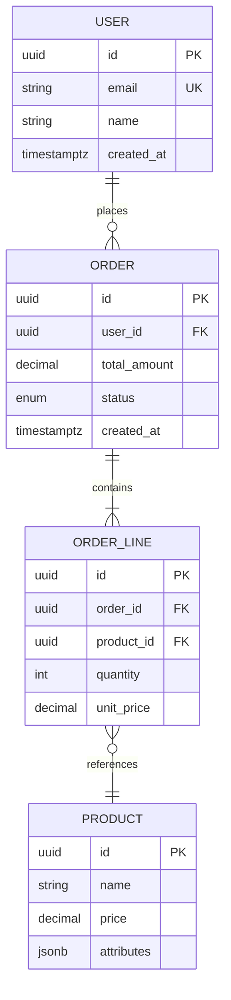

# Data Architecture — Deep Reference

**Always use `WebSearch` to verify current database versions, tool updates, and pricing before giving advice. The data tooling landscape evolves rapidly.**

## Table of Contents
1. [Storage Strategy Selection](#1-storage-strategy-selection)
2. [Relational Data Modeling](#2-relational-data-modeling)
3. [NoSQL Data Modeling](#3-nosql-data-modeling)
4. [Vector Databases and AI-Native Patterns](#4-vector-databases-and-ai-native-patterns)
5. [Data Pipeline Architecture](#5-data-pipeline-architecture)
6. [Migration Planning](#6-migration-planning)
7. [Data Lifecycle Management](#7-data-lifecycle-management)
8. [Data Governance](#8-data-governance)
9. [Modeling Tools and ERDs](#9-modeling-tools-and-erds)
10. [Real-World Patterns](#10-real-world-patterns)

---

## 1. Storage Strategy Selection

### Database Selection Matrix

| Access Pattern | Best Storage | Why |
|---------------|-------------|-----|
| **Structured data, complex queries, transactions** | PostgreSQL, MySQL | ACID, SQL, mature ecosystem |
| **High-write throughput, simple key access** | DynamoDB, Cassandra, ScyllaDB | Horizontal scaling, tunable consistency |
| **Document storage, flexible schema** | MongoDB, Firestore | Schema flexibility, nested documents |
| **Graph traversals, relationship queries** | Neo4j, Neptune, Memgraph | Efficient relationship traversal |
| **Time-series data** | TimescaleDB, InfluxDB, QuestDB | Time-partitioned, downsampling, retention |
| **Full-text search** | Elasticsearch, Meilisearch, Typesense | Inverted index, relevance scoring, facets |
| **Cache / session store** | Redis, Memcached, Valkey | Sub-ms latency, TTL, data structures |
| **Vector similarity search** | pgvector, Pinecone, Qdrant, Weaviate | Embedding storage, ANN search, RAG |
| **Blob / file storage** | S3, GCS, R2 | Cheap, durable, CDN-friendly |
| **Analytics / OLAP** | BigQuery, Snowflake, ClickHouse, DuckDB | Columnar, SQL, massive datasets |
| **Event log / streaming** | Kafka, Redpanda | Append-only, replay, high throughput |

### Decision Framework

Ask these questions to choose storage:

1. **What are the access patterns?** Read-heavy vs write-heavy, random vs sequential, point lookups vs scans
2. **What consistency model do you need?** Strong (financial) vs eventual (social feeds) vs causal (collaborative)
3. **What's the data volume?** GBs (single node) vs TBs (clustered) vs PBs (distributed)
4. **What's the query complexity?** Simple key-value vs complex JOINs vs graph traversals vs full-text search
5. **What are the latency requirements?** Sub-ms (cache) vs <10ms (operational DB) vs seconds (analytics)
6. **What's the budget?** Open-source self-managed vs managed service vs serverless pay-per-query

### Polyglot Persistence

Most production systems use multiple databases:

```
User-facing reads    → Redis (cache) → PostgreSQL (source of truth)
Search functionality → Elasticsearch (search index) ← CDC from PostgreSQL
Analytics/Reporting  → ClickHouse / BigQuery ← ETL from PostgreSQL
AI/ML features       → pgvector / Qdrant (vector search) ← Embedding pipeline
File storage         → S3 + CDN
```

The key challenge is keeping these in sync. Use CDC (Debezium) or event-driven architecture to propagate changes from the source of truth.

---

## 2. Relational Data Modeling

### Normalization Guide

| Form | Rule | When to Apply |
|------|------|---------------|
| **1NF** | Atomic values, no repeating groups | Always |
| **2NF** | No partial dependencies on composite keys | Multi-column primary keys |
| **3NF** | No transitive dependencies | Default for OLTP |
| **BCNF** | Every determinant is a candidate key | Complex key relationships |

**When to denormalize:**
- Read-heavy workloads where JOINs are expensive
- Reporting/analytics queries (pre-aggregate)
- Caching layers (store computed views)
- NoSQL migration targets (embed related data)

**Rule of thumb**: Normalize for writes (OLTP), denormalize for reads (OLAP/cache).

### PostgreSQL-Specific Patterns

PostgreSQL is the default choice for most applications. Key features:

**JSONB for semi-structured data:**
```sql
-- Store flexible attributes alongside structured data
CREATE TABLE products (
    id UUID PRIMARY KEY DEFAULT gen_random_uuid(),
    name TEXT NOT NULL,
    price NUMERIC(10,2) NOT NULL,
    attributes JSONB DEFAULT '{}',
    created_at TIMESTAMPTZ DEFAULT now()
);

-- Index JSONB fields
CREATE INDEX idx_products_brand ON products USING GIN ((attributes->'brand'));

-- Query JSONB
SELECT * FROM products WHERE attributes->>'brand' = 'Nike';
```

**Partitioning for large tables:**
```sql
-- Range partitioning by date (most common)
CREATE TABLE events (
    id BIGINT GENERATED ALWAYS AS IDENTITY,
    event_type TEXT NOT NULL,
    payload JSONB,
    created_at TIMESTAMPTZ NOT NULL
) PARTITION BY RANGE (created_at);

CREATE TABLE events_2024_q1 PARTITION OF events
    FOR VALUES FROM ('2024-01-01') TO ('2024-04-01');
CREATE TABLE events_2024_q2 PARTITION OF events
    FOR VALUES FROM ('2024-04-01') TO ('2024-07-01');
```

### Indexing Strategy

| Index Type | When to Use | PostgreSQL |
|-----------|-------------|-----------|
| **B-tree** | Equality and range queries (default) | `CREATE INDEX` (default) |
| **Hash** | Equality only, slightly faster than B-tree | `USING HASH` |
| **GIN** | Full-text search, JSONB, arrays | `USING GIN` |
| **GiST** | Geometric data, range types, full-text | `USING GiST` |
| **BRIN** | Large tables with natural ordering (time-series) | `USING BRIN` — tiny index, huge tables |
| **Partial** | Index only rows matching a condition | `WHERE active = true` |
| **Covering** | Include non-indexed columns to avoid table lookup | `INCLUDE (col1, col2)` |

**Index anti-patterns:**
- Too many indexes (slows writes, wastes storage)
- Indexing low-cardinality columns (boolean, status with few values)
- Not using `EXPLAIN ANALYZE` to verify index usage
- Forgetting to vacuum/analyze after bulk operations

### PostgreSQL Extensions

| Extension | What It Does |
|-----------|-------------|
| **pgvector** | Vector similarity search (embeddings, RAG) |
| **TimescaleDB** | Time-series data with hypertables, compression, continuous aggregates |
| **Citus** | Distributed PostgreSQL (horizontal scaling, multi-tenant) |
| **PostGIS** | Geospatial data and queries |
| **pg_stat_statements** | Query performance tracking |
| **pgcrypto** | Encryption functions |

---

## 3. NoSQL Data Modeling

### DynamoDB Single-Table Design

Model all entities in one table using composite keys:

```
PK              | SK                  | Data
USER#123        | PROFILE             | {name, email, ...}
USER#123        | ORDER#2024-001      | {total, status, ...}
USER#123        | ORDER#2024-002      | {total, status, ...}
PRODUCT#456     | METADATA            | {name, price, ...}
PRODUCT#456     | REVIEW#789          | {rating, text, ...}
ORDER#2024-001  | ITEM#1              | {productId, qty, ...}
```

**Design principles:**
1. Start from access patterns, not entity relationships
2. Use composite sort keys for hierarchical data
3. Denormalize aggressively (no JOINs)
4. Use GSIs (Global Secondary Indexes) for alternate access patterns
5. Keep items small (<400KB)

### MongoDB Document Modeling

**Embed vs Reference:**

| Strategy | When to Use | Example |
|----------|-------------|---------|
| **Embed** | Data always accessed together, 1:few relationship | Address in User document |
| **Reference** | Data accessed independently, 1:many or many:many | Comments referencing Post by ID |
| **Hybrid** | Embed summary, reference full data | Embed recent 3 comments, reference all via comment collection |

**Schema design patterns:**
- **Bucket pattern**: Group time-series data into fixed-size documents (e.g., hourly buckets of IoT readings)
- **Outlier pattern**: Handle outliers separately (user with 1M followers stored differently from typical user)
- **Computed pattern**: Pre-compute aggregates on write to avoid expensive reads

### Cassandra / ScyllaDB Data Modeling

Designed for massive write throughput and horizontal scaling:

**Partition key design (most critical decision):**
- Partition key determines data distribution across nodes
- Queries MUST include the partition key
- Avoid hot partitions (uneven data distribution)
- Compound partition keys for better distribution: `((user_id, bucket_date), event_time)`

**ScyllaDB vs Cassandra:**
- ScyllaDB: C++ implementation, 10x throughput, compatible with Cassandra drivers
- Cassandra: Java, more mature, larger community
- Both use CQL (Cassandra Query Language)

---

## 4. Vector Databases and AI-Native Patterns

### Vector Database Landscape

With RAG (Retrieval-Augmented Generation) becoming standard for AI applications, vector databases have become a critical infrastructure component:

| Database | Type | Best For |
|----------|------|----------|
| **pgvector** | PostgreSQL extension | Apps already using PostgreSQL, moderate scale, simplicity |
| **Pinecone** | Managed SaaS | Lowest operational overhead, serverless, production RAG |
| **Qdrant** | Open-source, Rust | High performance, rich filtering, self-hosted control |
| **Weaviate** | Open-source, Go | Multi-modal, built-in vectorization, GraphQL API |
| **Milvus** | Open-source, distributed | Large-scale (billions of vectors), GPU acceleration |
| **Chroma** | Open-source, Python | Developer-friendly, prototyping, embedded use |

### pgvector (Recommended Starting Point)

Use PostgreSQL's pgvector extension when:
- You already use PostgreSQL (no new infrastructure)
- You have < 10M vectors
- You need vector search + relational queries in the same transaction
- Simplicity matters more than maximum vector search throughput

```sql
-- Enable extension
CREATE EXTENSION vector;

-- Store embeddings alongside structured data
CREATE TABLE documents (
    id UUID PRIMARY KEY DEFAULT gen_random_uuid(),
    title TEXT NOT NULL,
    content TEXT NOT NULL,
    embedding vector(1536),  -- OpenAI ada-002 dimension
    metadata JSONB DEFAULT '{}'
);

-- Create HNSW index for approximate nearest neighbor
CREATE INDEX ON documents USING hnsw (embedding vector_cosine_ops);

-- Similarity search
SELECT id, title, 1 - (embedding <=> $1) AS similarity
FROM documents
ORDER BY embedding <=> $1  -- cosine distance
LIMIT 10;
```

### RAG Data Architecture

```
Document Ingestion Pipeline:
  Documents → Chunking → Embedding Model → Vector DB
                                          ↓
User Query Flow:
  User Query → Embedding → Vector Search → Top-K chunks → LLM (with context) → Response
```

**Key design decisions:**
- **Chunk size**: 256-1024 tokens (smaller = more precise retrieval, larger = more context)
- **Overlap**: 10-20% overlap between chunks to avoid losing context at boundaries
- **Embedding model**: OpenAI text-embedding-3-small (1536d), Cohere embed-v3, or open-source (nomic-embed, BGE)
- **Reranking**: Use a cross-encoder reranker (Cohere Rerank, BGE-reranker) after initial vector search for better precision
- **Hybrid search**: Combine vector similarity with keyword search (BM25) for better recall

---

## 5. Data Pipeline Architecture

### Batch vs Streaming vs Lakehouse

| Architecture | Data Freshness | Complexity | Best For |
|-------------|---------------|-----------|----------|
| **Batch ETL** | Hours | Low | Reporting, analytics, data warehouse |
| **Streaming** | Seconds | High | Real-time dashboards, alerts, event processing |
| **Lambda** | Both (batch + streaming) | Very high (two codepaths) | Not recommended (complexity rarely justified) |
| **Kappa** | Seconds (streaming only) | Medium | When everything can be modeled as streams |
| **Lakehouse** | Minutes to hours | Medium | Unified analytics, ML, and AI workloads |

### Lakehouse Architecture

The lakehouse is emerging as the dominant data architecture, combining the flexibility of data lakes with the structure of data warehouses:

```
Sources → Ingestion → Object Storage (S3/GCS) → Open Table Format → Query Engine → Consumers
          (Fivetran,   (cheap, durable)          (Iceberg/Delta)     (Spark,        (BI, ML,
           Airbyte,                                                   Trino,          AI)
           Kafka)                                                     DuckDB)
```

**Open table formats** (the key innovation):

| Format | Backed By | Key Features |
|--------|-----------|-------------|
| **Apache Iceberg** | Netflix, Apple, AWS | ACID on S3, time travel, schema evolution, partition evolution. De facto standard. |
| **Delta Lake** | Databricks | ACID, time travel, Z-ordering, tight Spark integration |
| **Apache Hudi** | Uber | Incremental processing, record-level updates, CDC-friendly |

**Iceberg is winning**: Gartner has upgraded lakehouse from "high-benefit" to "transformational," and Iceberg has emerged as the de facto standard for enterprises seeking an open, vendor-neutral format.

### dbt for Data Transformation

dbt (data build tool) has become the standard for SQL-based data transformation:

```sql
-- models/orders/daily_revenue.sql
{{ config(materialized='incremental', unique_key='date') }}

SELECT
    DATE_TRUNC('day', created_at) AS date,
    COUNT(*) AS total_orders,
    SUM(total_amount) AS revenue
FROM {{ ref('stg_orders') }}

WHERE created_at > (SELECT MAX(date) FROM {{ this }})

GROUP BY 1
```

**dbt capabilities:**
- SQL-based transformations with Jinja templating
- Model dependencies and DAG execution
- Built-in testing (not null, unique, accepted values, relationships)
- Documentation generation
- Incremental models (only process new data)
- Snapshot (SCD Type 2 for slowly changing dimensions)

---

## 6. Migration Planning

### Zero-Downtime Migration Patterns

#### Expand and Contract (Recommended Default)

```
Phase 1 — Expand:
  1. Add new column as nullable (no downtime)
  2. Deploy code that writes to BOTH old and new columns
  3. Backfill existing rows (batch, off-peak)
  4. Add index on new column (CONCURRENTLY in PostgreSQL)

Phase 2 — Verify:
  5. Deploy code that reads from new column
  6. Monitor for correctness

Phase 3 — Contract:
  7. Deploy code that stops writing to old column
  8. Drop old column (low-risk, data already migrated)
```

**Key principle**: Every migration must be backward-compatible with currently running code. Deploy code changes and schema changes independently.

#### Dual-Write Migration (Database Migration)

When migrating between database engines (e.g., MySQL → PostgreSQL):

```
Phase 1: Dual-write
  App writes to BOTH old and new databases
  App reads from OLD database

Phase 2: Shadow reads
  App writes to BOTH
  App reads from NEW, compares with OLD (shadow mode)

Phase 3: Cutover
  App reads from NEW
  App writes to BOTH (safety net)

Phase 4: Cleanup
  App writes to NEW only
  Decommission OLD
```

#### CDC-Based Migration

Use Change Data Capture for zero-downtime migration:

```
Old DB → Debezium → Kafka → New DB writer → New DB
         (captures WAL)                      (keeps in sync)

1. Start CDC, let new DB catch up
2. Switch reads to new DB (verify consistency)
3. Switch writes to new DB
4. Stop CDC, decommission old DB
```

### Schema Migration Tools

| Tool | Language | Database Support | Key Features |
|------|----------|-----------------|-------------|
| **Flyway** | Java | All major RDBMS | SQL + Java migrations, versioned, community edition free |
| **Liquibase** | Java | All major RDBMS | XML/YAML/SQL, rollback support, diff |
| **Atlas** | Go | PostgreSQL, MySQL, SQLite, SQL Server | Declarative schema, drift detection, CI/CD integration |
| **golang-migrate** | Go | PostgreSQL, MySQL, MongoDB, more | Lightweight, CLI + library, up/down migrations |
| **Alembic** | Python | SQLAlchemy-supported | Auto-generate from models, branching |
| **Prisma Migrate** | TypeScript | PostgreSQL, MySQL, SQLite, SQL Server | Schema-first, auto-generated SQL |
| **Drizzle Kit** | TypeScript | PostgreSQL, MySQL, SQLite | Lightweight, type-safe, push/pull |

**Recommendation**: Use Atlas for Go projects (declarative, drift detection). Use Alembic for Python (SQLAlchemy integration). Use Prisma or Drizzle for TypeScript. Use Flyway for Java.

---

## 7. Data Lifecycle Management

### Data Retention Strategy

| Data Tier | Storage | Access Pattern | Cost | Example |
|-----------|---------|---------------|------|---------|
| **Hot** | Primary DB (SSD) | Frequent reads/writes | $$$ | Active orders, user sessions |
| **Warm** | Read replicas, archive tables | Occasional reads | $$ | Last 90 days of orders, recent analytics |
| **Cold** | Object storage (S3 Standard-IA) | Rare access | $ | Historical data, audit logs |
| **Frozen** | Object storage (S3 Glacier) | Compliance/legal hold | ¢ | Regulatory archives, legal hold |

### GDPR Right to Erasure

Technical implementation:
1. **Identify PII locations**: Map all places personal data is stored (databases, caches, logs, backups, third-party services)
2. **Soft delete + anonymize**: Replace PII with anonymized values, don't hard-delete (breaks referential integrity)
3. **Cascade to derived data**: Propagate deletion to search indexes, analytics, caches, data warehouse
4. **Backup handling**: Tag backups containing PII; when restoring, re-apply deletions
5. **Third-party notification**: Inform data processors (analytics, CRM, etc.) of erasure request
6. **Audit trail**: Log the erasure action itself (not the deleted data) for compliance

### Data Tiering Automation

```sql
-- PostgreSQL: Move old data to archive partition
-- Step 1: Create archive partition
CREATE TABLE orders_archive PARTITION OF orders
    FOR VALUES FROM ('2020-01-01') TO ('2023-01-01');

-- Step 2: Move archive partition to cheaper tablespace
ALTER TABLE orders_archive SET TABLESPACE slow_storage;
```

For cloud: Use S3 Lifecycle Rules or GCS Object Lifecycle to automatically move objects between tiers.

---

## 8. Data Governance

### Data Quality Frameworks

| Tool | Approach | Best For |
|------|----------|----------|
| **Great Expectations** | Python, expectation-based | Data pipeline validation, ML data quality |
| **Soda** | YAML checks, SQL | Simple checks, SaaS option, CI integration |
| **dbt tests** | SQL assertions in dbt | Built into dbt workflow, easy to start |
| **Monte Carlo** | Observability platform | Enterprise data observability, anomaly detection |
| **Elementary** | dbt-native | dbt projects, open-source observability |

### Data Contracts

Agreements between data producers and consumers about data schema, quality, and SLAs:

```yaml
# data-contract.yaml
schema:
  name: orders
  version: 2.1.0
  owner: order-team
fields:
  - name: order_id
    type: string
    required: true
    pattern: "^ord_[a-z0-9]+$"
  - name: total_amount
    type: decimal
    required: true
    constraints:
      minimum: 0
quality:
  freshness: "< 5 minutes"
  completeness: "> 99.9%"
  uniqueness:
    - order_id
sla:
  availability: "99.9%"
  latency_p95: "< 1 second"
```

### Data Catalog and Lineage

| Tool | Type | Key Features |
|------|------|-------------|
| **DataHub** (LinkedIn) | Open-source | Metadata platform, lineage, governance, search |
| **OpenMetadata** | Open-source | Data discovery, lineage, quality, collaboration |
| **Amundsen** (Lyft) | Open-source | Data discovery, table popularity, owners |
| **Atlan** | SaaS | Enterprise data catalog, governance, collaboration |

### Schema Evolution Strategies

| Strategy | Description | Risk |
|----------|------------|------|
| **Additive only** | Only add new columns/fields, never remove | Lowest — old code ignores new fields |
| **Backward compatible** | New schema can read old data | Low — readers always work |
| **Forward compatible** | Old schema can read new data | Low — old consumers keep working |
| **Full compatible** | Both backward and forward | Lowest risk, highest restriction |
| **Breaking change** | Requires coordinated migration | Highest risk, sometimes necessary |

---

## 9. Modeling Tools and ERDs

### ERD and Data Modeling Tools

| Tool | Type | Best For |
|------|------|----------|
| **dbdiagram.io** | Web, DSL-based | Quick ERDs, DBML format, shareable |
| **Eraser.io** | Web, AI-assisted | Architecture + data diagrams, team collab |
| **DrawSQL** | Web, visual | Visual ERD builder, PostgreSQL/MySQL export |
| **pgModeler** | Desktop | PostgreSQL-specific modeling, forward/reverse engineering |
| **DataGrip** (JetBrains) | IDE | Database IDE with visual schema editor |
| **DBeaver** | Desktop, open-source | ERD visualization from existing databases |
| **Mermaid erDiagram** | Text (Markdown) | Inline ERDs in documentation |

### Mermaid ERD Example



---

## 10. Real-World Patterns

### Uber: Docstore and Schema Management

Uber developed Docstore, a distributed database built on MySQL with application-level sharding. Key learnings:
- Shard by tenant/city for geographic isolation
- Schema changes through shadow table approach (no locking)
- Read replicas for analytics, write to primary only

### Netflix: Data Mesh Implementation

Netflix moved toward data mesh principles:
- Domain teams own their data products
- Self-serve data infrastructure platform
- Federated computational governance (automated quality checks)
- Centralized catalog (discovery) with decentralized ownership

### Shopify: Database Sharding

Shopify shards their PostgreSQL databases by shop:
- Each shop's data lives on one shard
- Shard key = shop_id
- ProxySQL for query routing
- Vitess for MySQL sharding (some workloads)
- Key insight: shard by the natural partition (shop/tenant), not by table

### PostgreSQL at Scale Decision Points

| Scale | Architecture | When |
|-------|-------------|------|
| **< 100GB** | Single PostgreSQL instance | Most applications |
| **100GB-1TB** | Primary + read replicas | Read-heavy workloads |
| **1TB-10TB** | Citus (distributed) or partitioning | Multi-tenant, large tables |
| **> 10TB** | Sharded (Citus, Vitess) or specialized DB | Specific access patterns exceed PostgreSQL |

---

## Decision Framework Summary

| Decision | Default | Switch When |
|----------|---------|-------------|
| **Primary database** | PostgreSQL | NoSQL access patterns (DynamoDB), graph data (Neo4j), time-series (TimescaleDB) |
| **Cache** | Redis | Simpler needs (Memcached), Redis fork concerns (Valkey) |
| **Search** | PostgreSQL full-text (small) | Dedicated search (Elasticsearch/Meilisearch for complex search UX) |
| **Vector search** | pgvector | > 10M vectors or maximum throughput (Qdrant, Pinecone) |
| **Analytics** | PostgreSQL + dbt (small) | Large scale (Snowflake, BigQuery, ClickHouse) |
| **Data pipeline** | dbt + Dagster | Simple (Airflow), SaaS extract (Fivetran/Airbyte) |
| **Table format** | Apache Iceberg | Databricks-centric (Delta Lake), CDC-heavy (Hudi) |
| **Migration tool** | Atlas (Go), Alembic (Python), Prisma/Drizzle (TypeScript), Flyway (Java) | Based on language ecosystem |
| **Schema evolution** | Additive only | Full compatible (Schema Registry), breaking (coordinated migration) |
| **Data quality** | dbt tests | Advanced observability (Great Expectations, Monte Carlo) |
| **ERD tool** | dbdiagram.io or Mermaid | PostgreSQL-specific (pgModeler), IDE-based (DataGrip) |
