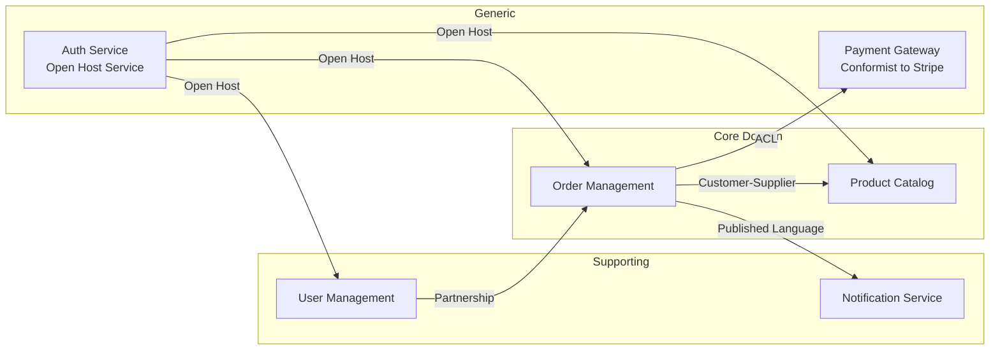

# Domain Modeling — Deep Reference

**Always use `WebSearch` to verify current framework versions and tooling before giving advice. DDD principles are stable but implementations evolve.**

## Table of Contents
1. [Strategic DDD](#1-strategic-ddd)
2. [Tactical DDD](#2-tactical-ddd)
3. [Event Storming](#3-event-storming)
4. [Domain Events and Event-Driven DDD](#4-domain-events-and-event-driven-ddd)
5. [DDD and System Architecture](#5-ddd-and-system-architecture)
6. [Ubiquitous Language](#6-ubiquitous-language)
7. [DDD Frameworks and Libraries](#7-ddd-frameworks-and-libraries)
8. [Common Mistakes](#8-common-mistakes)
9. [When DDD Is Overkill](#9-when-ddd-is-overkill)

---

## 1. Strategic DDD

Strategic DDD is about understanding the big picture — where the domain boundaries are, how different parts of the system relate, and which parts deserve the most investment.

### Subdomains

Every business domain can be decomposed into subdomains:

| Type | Description | Investment Level | Example |
|------|------------|-----------------|---------|
| **Core** | What makes your business unique. Competitive advantage. | Highest — build custom, invest deeply | Recommendation engine at Netflix, pricing algorithm at Uber |
| **Supporting** | Necessary for the business but not differentiating | Medium — build or buy | User management, notification system |
| **Generic** | Solved problems, commoditized | Lowest — buy off-the-shelf or use SaaS | Email sending (SendGrid), payments (Stripe), auth (Auth0) |

**Key insight**: Most teams over-invest in generic subdomains and under-invest in core subdomains. The architecture should reflect this — spend your best engineers and most careful design on the core domain.

### Bounded Contexts

A bounded context is a boundary within which a domain model is consistent and a specific ubiquitous language applies. The same real-world concept may have different representations in different contexts.

**Example — "Customer" in an e-commerce system:**
- **Sales Context**: Customer has a shopping cart, order history, wishlist
- **Billing Context**: Customer has payment methods, invoices, credit balance
- **Shipping Context**: Customer has addresses, delivery preferences, tracking history
- **Support Context**: Customer has tickets, satisfaction score, interaction history

Each context has its own model of "Customer" with different attributes and behaviors. This is not duplication — it's appropriate modeling.

### Context Mapping Patterns

How bounded contexts relate to each other:

| Pattern | Relationship | When to Use |
|---------|-------------|-------------|
| **Partnership** | Two teams cooperate, co-evolve their models | Teams with shared goals, high trust, similar schedules |
| **Shared Kernel** | Two contexts share a small common model | Small, stable overlap (e.g., shared ID types, money type) |
| **Customer-Supplier** | Upstream provides what downstream needs | Clear dependency direction, upstream accommodates downstream |
| **Conformist** | Downstream adopts upstream's model as-is | When upstream won't or can't adapt (third-party API) |
| **Anti-Corruption Layer (ACL)** | Translation layer protects downstream from upstream model | Integrating with legacy systems, third-party APIs, different domain languages |
| **Open Host Service** | Upstream exposes a well-defined API for multiple consumers | Public APIs, platform services with many consumers |
| **Published Language** | Shared language for integration (e.g., iCalendar, JSON-LD) | Industry standards, open protocols |
| **Separate Ways** | No integration — contexts are independent | When integration cost exceeds benefit |

### How to Discover Bounded Contexts

1. **Listen for language changes**: When the same word means different things to different people, you're at a context boundary
2. **Event Storming**: Map domain events to find natural groupings (see section 3)
3. **Organizational alignment**: Conway's Law — system boundaries tend to mirror team boundaries
4. **Data ownership**: Where does data originate? Who is the authoritative source?
5. **Rate of change**: Parts that change together should be in the same context

### Context Map Visualization



---

## 2. Tactical DDD

Tactical patterns are the building blocks for implementing a domain model within a bounded context.

### Aggregates

An aggregate is a cluster of domain objects that can be treated as a single unit for data consistency. It has a root entity (the aggregate root) through which all access is controlled.

**Aggregate Design Rules (Vaughn Vernon):**

1. **Protect true invariants within a single aggregate**: Business rules that must always be consistent belong in one aggregate
2. **Design small aggregates**: Prefer single-entity aggregates. Large aggregates = concurrency bottlenecks
3. **Reference other aggregates by identity (ID), not by object reference**: This keeps aggregates independent and allows them to live in different databases
4. **Use eventual consistency across aggregates**: If a rule spans aggregates, use domain events + eventual consistency

**Sizing guide:**
- **Too large**: If updating one part of the aggregate requires loading the entire thing (e.g., an Order aggregate that includes all OrderLines, all Payments, all Shipments) — split it
- **Too small**: If you constantly need transactions across multiple aggregates for basic operations — merge them
- **Right size**: An aggregate should represent a transactional consistency boundary that matches a business invariant

**Example — Order aggregate:**
```
Order (Aggregate Root)
├── OrderLine (Entity, owned by Order)
│   └── Quantity, ProductId, UnitPrice
├── ShippingAddress (Value Object)
└── OrderStatus (Value Object)

Invariants enforced by Order:
- Total must be recalculated when lines change
- Cannot add lines after order is shipped
- At least one line required
```

### Entities vs Value Objects

| Characteristic | Entity | Value Object |
|---------------|--------|-------------|
| **Identity** | Has a unique ID | Defined by its attributes |
| **Equality** | Same ID = same entity | Same attributes = equal |
| **Mutability** | Can change state over time | Immutable (replace, don't update) |
| **Example** | User, Order, Product | Money, Address, DateRange, Email |

**Prefer value objects**: They're simpler, immutable, and easier to test. Many things modeled as entities should be value objects.

### Domain Services

Operations that don't naturally belong to any entity or value object:
- **Cross-aggregate operations**: Transfer money between accounts
- **External system interactions**: Check inventory availability
- **Complex calculations**: Calculate shipping cost based on multiple factors

A domain service should be stateless and operate on aggregates/value objects.

### Repositories

Provide collection-like interfaces for accessing aggregates:
- One repository per aggregate root (never for child entities)
- Repository interface is defined in the domain layer
- Repository implementation is in the infrastructure layer
- Methods: `findById`, `save`, `delete`, `findByCriteria`

### Factories

Encapsulate complex object creation:
- Use when constructing an aggregate requires complex logic or multiple steps
- Can be a static factory method on the aggregate root or a dedicated factory class
- Ensure the created object is always in a valid state

---

## 3. Event Storming

### What Is Event Storming?

A collaborative workshop technique invented by Alberto Brandolini to explore a business domain through domain events. It reveals business processes, bounded contexts, and aggregates through group discussion rather than formal modeling.

### Big Picture Event Storming

**Purpose**: Discover the entire business domain at a high level.
**Duration**: 2-4 hours
**Participants**: Domain experts, developers, product managers, stakeholders (6-15 people)
**Materials**: Large wall/whiteboard, colored sticky notes, markers

**Process:**
1. **Domain Events (orange stickies)**: Everyone writes events that happen in the business ("Order Placed", "Payment Received", "Item Shipped"). Past tense. No filtering.
2. **Timeline**: Arrange events chronologically on the wall, left to right
3. **Hot Spots (red/pink stickies)**: Mark areas of confusion, disagreement, or missing knowledge
4. **External Systems (gray stickies)**: Identify systems outside your control
5. **People/Actors (small yellow stickies)**: Who triggers or responds to events
6. **Bounded Contexts**: Look for natural groupings — clusters of events that belong together

### Design-Level Event Storming

**Purpose**: Design the internal structure of a bounded context.
**Duration**: 2-4 hours per context
**Participants**: Developers + domain expert for that context (4-8 people)

**Additional elements:**
- **Commands (blue stickies)**: Actions that trigger events ("Place Order", "Cancel Subscription")
- **Aggregates (yellow stickies)**: Clusters of commands and events that share a consistency boundary
- **Policies (purple/lilac stickies)**: Rules that react to events ("When payment fails, retry 3 times then cancel")
- **Read Models (green stickies)**: Data views needed to make decisions

**Flow:**
```
Actor → Command → Aggregate → Domain Event → Policy → (next Command)
                                           → Read Model (for UI/reporting)
```

### Tools for Event Storming

| Tool | Type | Best For |
|------|------|----------|
| **Physical wall + stickies** | In-person | Best experience, highest engagement |
| **Miro** | Virtual whiteboard | Remote teams, persistent boards |
| **Mural** | Virtual whiteboard | Remote teams, structured templates |
| **FigJam** | Virtual whiteboard | Design-oriented teams |
| **EventStorming.com** | Purpose-built | Dedicated tool by Brandolini |

**Remote event storming tips:**
- Use a virtual whiteboard with infinite canvas (Miro/Mural)
- Pre-create color-coded sticky note templates
- Assign a facilitator who manages the timeline and flow
- Use breakout rooms for parallel exploration of different areas
- Time-box strictly — remote fatigue sets in faster

---

## 4. Domain Events and Event-Driven DDD

### Domain Events vs Integration Events

| Aspect | Domain Event | Integration Event |
|--------|-------------|------------------|
| **Scope** | Within a bounded context | Between bounded contexts |
| **Language** | Uses ubiquitous language of the context | Uses a published/shared language |
| **Payload** | Rich — contains domain-specific data | Lean — contains IDs and minimal data |
| **Delivery** | In-process (mediator pattern) | Out-of-process (message broker) |
| **Consistency** | Can be part of a transaction | Eventually consistent |
| **Example** | `OrderItemAdded { orderId, productId, quantity, unitPrice }` | `OrderPlaced { orderId, customerId, totalAmount, timestamp }` |

### Event Sourcing with DDD

Store the state of an aggregate as a sequence of events rather than the current state:

```
OrderCreated { orderId: 123, customerId: 456 }
ItemAdded { orderId: 123, productId: 789, qty: 2 }
ItemAdded { orderId: 123, productId: 101, qty: 1 }
ItemRemoved { orderId: 123, productId: 789 }
OrderSubmitted { orderId: 123, total: 49.99 }
```

**Benefits:**
- Complete audit trail — every state change is recorded
- Temporal queries — what was the state at time T?
- Event replay — rebuild read models or projections from the event log
- Debugging — replay events to reproduce bugs

**Challenges:**
- Schema evolution — events are immutable, but their shape must evolve (use upcasting)
- Storage growth — snapshots needed for aggregates with many events
- Read performance — current state requires replaying events (projections solve this)
- Complexity — only use for core domains where the benefits justify the cost

### CQRS + DDD

Separate the write model (command side) from the read model (query side):

- **Command side**: Rich domain model with aggregates, enforcing invariants
- **Query side**: Denormalized read models optimized for specific views
- **Sync**: Domain events flow from command side to query side via event bus

Use CQRS when: read and write patterns differ significantly, multiple read representations needed, different scaling requirements for reads vs writes.

### Event Schema Management

- **Schema Registry** (Confluent, Apicurio): Central registry for event schemas, compatibility checking
- **Avro**: Compact binary format with strong schema evolution support (backward/forward/full compatibility)
- **Protobuf**: Strong typing, smaller than JSON, good tooling (Buf CLI)
- **JSON Schema**: Human-readable, easy to get started, weaker evolution guarantees
- **CloudEvents**: Specification for describing events in a common format — metadata envelope for any payload

---

## 5. DDD and System Architecture

### Bounded Contexts → Services

Each bounded context can map to a deployable unit, but the mapping isn't always 1:1:

| Strategy | Description | When to Use |
|----------|------------|-------------|
| **1 context = 1 service** | Clean separation, independent deployment | Well-defined boundaries, separate teams |
| **Multiple contexts in one service** | Simpler deployment, shared infrastructure | Small team, related contexts, early-stage |
| **1 context = multiple services** | Split by subdomain within context | Very large contexts, different scaling needs |

### DDD in a Modular Monolith

DDD works exceptionally well with modular monoliths:
- Each module = one bounded context
- Module boundaries enforced by dependency rules (ArchUnit, Packwerk)
- Domain events dispatched in-process (no message broker needed)
- Modules communicate through defined interfaces, not direct data access
- Extraction to services later is straightforward along module boundaries

### Anti-Corruption Layer Implementation

When integrating with external systems or legacy code:

```
Your Domain ←→ ACL ←→ External System

ACL responsibilities:
1. Translate external model to your domain model
2. Translate your commands to external API calls
3. Handle external system failures gracefully
4. Isolate your domain from external changes
```

**Implementation patterns:**
- **Adapter pattern**: Wrap external APIs in your domain's interface
- **Translator/Mapper**: Convert between external DTOs and domain objects
- **Facade**: Simplify complex external APIs into domain-relevant operations

---

## 6. Ubiquitous Language

### What It Is

A shared language between developers and domain experts that is used consistently in code, conversations, documentation, and UI. Not a glossary bolted on after the fact — it's discovered through collaboration and reflected directly in the code.

### How to Develop It

1. **Listen to domain experts**: The language comes from the business, not from developers
2. **Challenge ambiguity**: When the same term means different things, you've found a context boundary
3. **Name things precisely**: "ProcessOrder" is vague. "SubmitOrderForFulfillment" is precise.
4. **Evolve the language**: As understanding deepens, rename concepts. Refactoring isn't just code — it's language.
5. **Use it everywhere**: In code (class names, method names, variable names), in tests, in documentation, in conversations

### Enforcing in Code

```java
// BAD — generic names, no domain language
class OrderService {
    void process(Order order) { ... }
    void update(Order order, int status) { ... }
}

// GOOD — ubiquitous language in code
class OrderFulfillment {
    void submitForFulfillment(Order order) { ... }
    void markAsShipped(Order order, TrackingNumber tracking) { ... }
    void cancelDueToStockout(Order order, StockoutReason reason) { ... }
}
```

### Language Boundaries

Different bounded contexts may use different names for the same real-world concept:
- Sales: "Prospect" → Marketing: "Lead" → Support: "Customer"
- Warehouse: "SKU" → Catalog: "Product" → Finance: "Line Item"

This is correct. Each context has its own language that makes sense within that context.

---

## 7. DDD Frameworks and Libraries

### Java / JVM

| Library | What It Provides |
|---------|-----------------|
| **Axon Framework** | Full CQRS + Event Sourcing framework. Aggregate lifecycle, command/event bus, saga management. Axon Server for event store. |
| **jMolecules** | Annotations to express DDD concepts (`@AggregateRoot`, `@Entity`, `@ValueObject`, `@Repository`). Works with ArchUnit for validation. |
| **Spring Modulith** | Module boundaries in Spring Boot. Event publication, module testing, architecture validation. |
| **EventStoreDB** | Event store database with projections and subscriptions. Language-agnostic but strong Java/JVM support. |

### TypeScript / Node.js

| Library | What It Provides |
|---------|-----------------|
| **NestJS CQRS module** | Command bus, event bus, saga support within NestJS |
| **ts-arch** | Architecture testing for TypeScript — enforce module boundaries |
| **EventStoreDB client** | Event sourcing with EventStoreDB |
| **Effect-ts** | Functional programming library with strong domain modeling patterns |

### Go

Go's simplicity aligns well with DDD — use plain structs, interfaces, and packages:
- Package = bounded context or module
- Struct = aggregate root, entity, or value object
- Interface = repository, domain service
- No framework needed — Go's standard library + clean architecture is sufficient

### Python

| Library | What It Provides |
|---------|-----------------|
| **eventsourcing** | Event sourcing library for Python |
| **Pydantic** | Value objects as Pydantic models (immutable, validated) |
| **SQLAlchemy** | Repository pattern with ORM |

---

## 8. Common Mistakes

### DDD Anti-Patterns

1. **Anemic Domain Model**: Entities with only getters/setters, all logic in services. The model is a data structure, not a behavior-rich domain model. Fix: move business logic into entities and value objects.

2. **CRUD-Driven Design**: Starting with database tables and generating entities. Domain model should drive the data model, not the reverse. Fix: model the domain first, then map to persistence.

3. **Big Aggregate**: One massive aggregate (e.g., `Customer` with all orders, addresses, preferences, history). Fix: split into small, focused aggregates referenced by ID.

4. **Shared Database Between Contexts**: Two bounded contexts reading/writing the same tables. This creates hidden coupling. Fix: each context owns its data; use events for synchronization.

5. **Ignoring Domain Expert Input**: Building a model based on technical assumptions rather than domain knowledge. Fix: pair with domain experts, use Event Storming, iterate on the model.

6. **DDD Everywhere**: Applying tactical DDD patterns to generic/supporting subdomains. Fix: reserve DDD for core domains; use simpler patterns (CRUD, Active Record) for generic subdomains.

---

## 9. When DDD Is Overkill

DDD is powerful but not always warranted. Skip tactical DDD when:

- **Simple CRUD**: If the domain is just create/read/update/delete with no business rules, DDD adds unnecessary complexity
- **Prototype/MVP**: When you're validating a business hypothesis, speed matters more than domain purity
- **Small team, simple domain**: If a team of 2-3 can hold the entire domain in their heads, DDD ceremony is overhead
- **Generic subdomain**: Use CRUD or Active Record for subdomains that aren't your competitive advantage

**Always use strategic DDD** (bounded contexts, context mapping, ubiquitous language) — it's valuable regardless of system complexity. Reserve tactical DDD (aggregates, domain events, event sourcing) for core domains where the investment pays off.

---

## Decision Framework Summary

| Decision | Default | Switch When |
|----------|---------|-------------|
| **Subdomain investment** | Core = custom, Generic = buy | Clear competitive advantage analysis |
| **Context discovery** | Event Storming | Formal context mapping for enterprise |
| **Aggregate size** | Small (single entity) | True invariants require multiple entities |
| **Cross-aggregate consistency** | Eventual (domain events) | Strong consistency required (merge aggregates) |
| **Event sourcing** | No (simple state persistence) | Audit trail, temporal queries, or event replay critical |
| **CQRS** | No (single model) | Read/write patterns differ significantly |
| **DDD framework** | None (plain language constructs) | Complex event sourcing needs (Axon, EventStoreDB) |
| **Inter-context communication** | Synchronous API calls | High throughput, decoupling needed (domain events via broker) |
