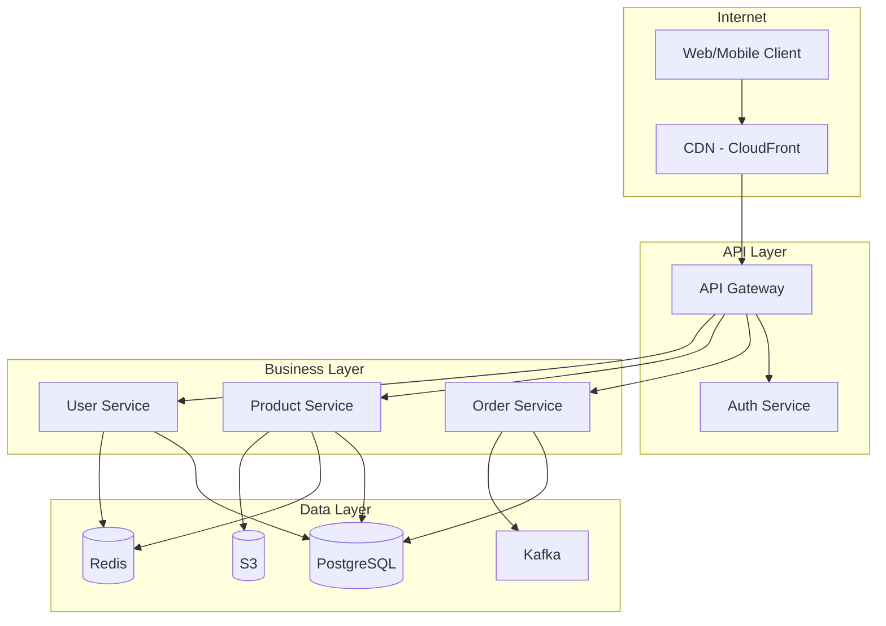

# Solution Architecture — Deep Reference

**Always use `WebSearch` to verify current tool versions, cloud service updates, and framework features before giving advice. This reference provides architectural context; the ecosystem evolves rapidly.**

## Table of Contents
1. [System Design Methodology](#1-system-design-methodology)
2. [Architecture Views and Frameworks](#2-architecture-views-and-frameworks)
3. [C4 Model and Diagramming](#3-c4-model-and-diagramming)
4. [Architecture Decision Records](#4-architecture-decision-records)
5. [Non-Functional Requirements](#5-non-functional-requirements)
6. [Architecture Evaluation](#6-architecture-evaluation)
7. [Cloud-Native Architecture](#7-cloud-native-architecture)
8. [Modern Architecture Patterns](#8-modern-architecture-patterns)
9. [Architecture Documentation](#9-architecture-documentation)
10. [Real-World Case Studies](#10-real-world-case-studies)

---

## 1. System Design Methodology

### The Solution Architecture Process

Top solution architects follow a consistent process regardless of scale:

```
1. Understand the Business Problem
   └─ Stakeholder interviews, domain discovery, business drivers
2. Identify Architecture Drivers
   └─ Key requirements, constraints, quality attributes, risks
3. Explore the Solution Space
   └─ Component identification, interaction patterns, data flow
4. Evaluate Tradeoffs
   └─ Present 2-3 viable approaches with pros/cons
5. Make and Record Decisions
   └─ ADRs for each significant choice
6. Validate the Architecture
   └─ Fitness functions, prototyping, stakeholder review
7. Evolve Incrementally
   └─ Architecture is a living artifact, not a one-time document
```

### Greenfield vs Brownfield

**Greenfield (new system):**
- Freedom to choose the right patterns, but danger of over-engineering
- Start with the simplest architecture that meets requirements
- Validate assumptions with prototypes before committing
- Key question: "What is the minimum architecture that lets us learn fast?"

**Brownfield (existing system):**
- Understand the existing system deeply before proposing changes
- Strangler Fig pattern: incrementally replace components behind a facade
- Identify the highest-value, lowest-risk extraction points
- Key question: "Where are the pain points, and what's the migration path?"

### Architecture Kata Practice
Architecture katas (Neal Ford) are exercises where teams practice designing systems under constraints. Use them to:
- Train architectural thinking in your team
- Explore tradeoffs without production pressure
- Build shared vocabulary and decision-making skills

---

## 2. Architecture Views and Frameworks

### C4 Model (Recommended Default)

Created by Simon Brown, the C4 model provides four levels of abstraction:

| Level | Name | Audience | Shows |
|-------|------|----------|-------|
| 1 | **Context** | Everyone (including non-technical) | System in its environment — users, external systems |
| 2 | **Container** | Technical people | High-level technology choices — apps, databases, message brokers |
| 3 | **Component** | Developers | Internal structure of a container — major components and their interactions |
| 4 | **Code** | Developers (optional) | Class/module level — usually auto-generated, rarely hand-drawn |

**Best practice**: Levels 1 and 2 are sufficient for most teams. Level 3 is useful for complex containers. Level 4 is rarely worth maintaining manually. According to 2025 State of DevOps reports, C4 adoption reduced documentation time by 70% and 50% of development teams now use C4 for stakeholder communication.

### 4+1 Architectural View Model (Philippe Kruchten)

| View | Concern | Stakeholders |
|------|---------|-------------|
| **Logical** | Functionality, domain structure | End users, domain experts |
| **Process** | Concurrency, performance, scalability | Integrators, performance engineers |
| **Development** | Software organization, modules | Developers, project managers |
| **Physical** | Deployment, infrastructure, topology | System engineers, ops teams |
| **+1 Scenarios** | Use cases that validate the other views | All stakeholders |

Use when: Enterprise environments with diverse stakeholders who need different perspectives.

### arc42 Template

A practical, open-source documentation template with 12 sections:
1. Introduction and Goals
2. Constraints
3. Context and Scope
4. Solution Strategy
5. Building Block View
6. Runtime View
7. Deployment View
8. Crosscutting Concepts
9. Architecture Decisions
10. Quality Requirements
11. Risks and Technical Debt
12. Glossary

Use when: You need a comprehensive but pragmatic documentation structure. arc42 is widely adopted in European engineering teams and pairs well with C4 diagrams.

---

## 3. C4 Model and Diagramming

### Structurizr DSL (Reference Implementation)

Structurizr is a "models as code" tool by Simon Brown. You define a single model, then generate multiple diagrams from it. This ensures consistency — if you rename a component, all diagrams update.

```
workspace {
    model {
        user = person "User" "A customer of the platform"
        softwareSystem = softwareSystem "E-Commerce Platform" {
            webapp = container "Web Application" "Next.js" "Serves the frontend"
            api = container "API Server" "Go + Chi" "REST API"
            db = container "Database" "PostgreSQL 16" "Stores orders, products, users"
            cache = container "Cache" "Redis" "Session and product cache"
            queue = container "Message Queue" "Kafka" "Order events"
        }
        user -> webapp "Browses products, places orders"
        webapp -> api "API calls" "HTTPS/JSON"
        api -> db "Reads/writes" "SQL"
        api -> cache "Reads/writes" "Redis protocol"
        api -> queue "Publishes order events" "Kafka protocol"
    }
    views {
        systemContext softwareSystem {
            include *
            autolayout lr
        }
        container softwareSystem {
            include *
            autolayout lr
        }
    }
}
```

Teams report cutting diagramming time by 60% after switching to Structurizr DSL. Python bindings (2026) enable programmatic construction of models.

### Diagramming Tool Landscape

| Tool | Best For | Format | Collaboration |
|------|----------|--------|---------------|
| **Structurizr DSL** | C4 models, diagrams-as-code | Text DSL | Git-based |
| **Mermaid** | Inline diagrams in markdown/docs | Text (Markdown) | Git-based, renders in GitHub/GitLab |
| **D2** | Programmatic, complex diagrams | Text DSL | Git-based |
| **Excalidraw** | Whiteboard-style, informal | JSON (hand-drawn look) | Real-time collab |
| **draw.io/diagrams.net** | General-purpose, free | XML | Real-time collab |
| **Eraser.io** | Architecture diagrams | Text + visual | Real-time collab |
| **IcePanel** | C4 model with interactive flows | Visual | Team collab |

**Recommendation**: Use Structurizr DSL for formal C4 models (version-controlled). Use Mermaid for inline documentation (renders in GitHub/GitLab/Notion). Use Excalidraw for brainstorming and whiteboarding.

### Mermaid for Architecture Diagrams

Mermaid is the pragmatic choice because it renders natively in GitHub, GitLab, Notion, and most documentation tools:



---

## 4. Architecture Decision Records

### What is an ADR?

An Architecture Decision Record captures a single architectural decision — the context, the options considered, the decision made, and the consequences. The collection of ADRs forms the project's decision log.

### Why ADRs Matter

Without ADRs, architectural decisions become tribal knowledge. New team members ask "why did we choose Kafka over RabbitMQ?" and no one remembers the original reasoning. ADRs prevent:
- Relitigating decisions (the context is documented)
- Cargo-culting (the rationale explains *why*, not just *what*)
- Architectural drift (decisions are reviewed when context changes)

### MADR Template (Recommended)

Markdown Any Decision Records — the most widely adopted template:

```markdown
# ADR-001: Use PostgreSQL as primary database

## Status
Accepted (2024-03-15)

## Context
We need a primary database for the order management system. Expected load
is 5K writes/sec and 50K reads/sec. We need ACID transactions for financial
data and JSON storage for flexible product attributes.

## Decision Drivers
- ACID compliance required for order transactions
- Team has strong PostgreSQL expertise (3 senior DBAs)
- Need JSONB for semi-structured product metadata
- Budget: prefer open-source over licensed databases

## Considered Options
1. PostgreSQL 16
2. MySQL 8
3. CockroachDB (distributed SQL)

## Decision
PostgreSQL 16 with Citus extension for future horizontal scaling.

## Consequences
- Good: Team expertise, JSONB support, rich extension ecosystem (pgvector, TimescaleDB)
- Bad: Single-node scaling limit (~50K TPS), need Citus or PgBouncer for horizontal scale
- Neutral: Standard operational tooling, mature backup/restore
```

### ADR Tooling

| Tool | Language | Format | Features |
|------|----------|--------|----------|
| **Log4brains** | Node.js | MADR | Static site generation, search, timeline view, CI integration |
| **adr-tools** | Bash | Nygard | Simple CLI, `adr new`, `adr link`, lightweight |
| **ADG** | Go | Nygard/MADR/QOC | Modeling, reuse, guidance |
| **dotnet-adr** | .NET | Multiple | Cross-platform .NET global tool |
| **ReflectRally** | Web | Collaborative | Web-based, team discussions, structured review workflows |

**Recommendation**: Use MADR format. Store ADRs in `docs/adr/` in your repo. For teams that need a browsable site, add Log4brains. For lightweight needs, `adr-tools` is sufficient.

### When to Write an ADR

Write an ADR when:
- The decision affects multiple teams or services
- The decision is hard to reverse (database choice, message broker, language)
- There were multiple viable options and the reasoning should be preserved
- A future team member would ask "why did we do this?"

Don't write an ADR for:
- Trivial decisions (library version bumps, variable naming)
- Decisions that are easily reversible and low-impact
- Decisions already covered by team conventions or style guides

---

## 5. Non-Functional Requirements

### ISO 25010 Quality Model

The standard framework for classifying system quality attributes:

| Characteristic | Sub-characteristics | Example Requirement |
|---------------|--------------------|--------------------|
| **Performance** | Time behavior, throughput, capacity | "API response time < 200ms at p95" |
| **Reliability** | Availability, fault tolerance, recoverability | "99.9% uptime, RPO < 1 hour" |
| **Security** | Confidentiality, integrity, authenticity | "All data encrypted at rest and in transit" |
| **Maintainability** | Modularity, reusability, testability | "Unit test coverage > 80%, deploy in < 15 min" |
| **Portability** | Adaptability, installability | "Run on any Kubernetes cluster" |
| **Usability** | Learnability, accessibility | "WCAG 2.2 AA compliance" |
| **Compatibility** | Interoperability, coexistence | "Support OAuth 2.0 and SAML" |
| **Functional Suitability** | Correctness, completeness | "Process 10K orders/day without data loss" |

### Capturing NFRs Systematically

Use a quality attribute scenario format:

```
Source:     External user
Stimulus:   Submits an order during peak load (Black Friday)
Artifact:   Order processing service
Environment: Normal + 10x traffic spike
Response:   Order is accepted and confirmed
Measure:    Within 500ms, 99.9% success rate, zero data loss
```

### Quality Attribute Workshop (QAW)

A structured technique to elicit and prioritize quality attributes:
1. Present business drivers and architecture overview
2. Brainstorm quality attribute scenarios (stakeholders write scenarios)
3. Consolidate and eliminate duplicates
4. Prioritize scenarios (vote on importance + difficulty)
5. Refine top scenarios into testable requirements

### Architecture Fitness Functions

Automated checks that verify architectural characteristics are maintained:

| Type | Example | Tool |
|------|---------|------|
| **Structural** | No circular dependencies between modules | ArchUnit, dependency-cruiser |
| **Performance** | p95 latency < 200ms | k6, Locust (load test in CI) |
| **Security** | No critical CVEs in dependencies | Snyk, Dependabot, Trivy |
| **Deployment** | Deploy time < 15 minutes | CI/CD pipeline metric |
| **Coupling** | Service A doesn't directly access Service B's database | Custom lint rule |

---

## 6. Architecture Evaluation

### ATAM (Architecture Tradeoff Analysis Method)

Formal evaluation method for critical systems:
1. Present business drivers and architecture
2. Identify architectural approaches (patterns used)
3. Generate quality attribute utility tree (importance × difficulty)
4. Analyze approaches against scenarios
5. Identify sensitivity points, tradeoff points, and risks
6. Report findings

Use when: High-stakes systems (financial, healthcare, safety-critical) where architectural decisions have significant consequences.

### Lightweight Architecture Evaluation

For most teams, a lighter approach works:

1. **Architecture Review Board**: Weekly/biweekly review of proposed changes by senior engineers
2. **Fitness Functions**: Automated checks in CI/CD (see above)
3. **Chaos Engineering**: Verify resilience assumptions (Chaos Monkey, Litmus)
4. **Load Testing**: Validate performance assumptions under realistic load
5. **Architecture Spikes**: Time-boxed prototypes to validate risky assumptions

### Risk-Storming

Visual exercise to identify architecture risks:
1. Show the architecture diagram to the team
2. Each person silently identifies risks (on sticky notes)
3. Color-code by severity: red (critical), amber (significant), green (minor)
4. Place risks on the diagram near the affected component
5. Discuss, prioritize, and create mitigation plans

---

## 7. Cloud-Native Architecture

### Well-Architected Frameworks

All major cloud providers offer architecture review frameworks:

| Provider | Framework | Pillars |
|----------|-----------|---------|
| **AWS** | Well-Architected | Operational Excellence, Security, Reliability, Performance Efficiency, Cost Optimization, Sustainability |
| **Azure** | Well-Architected | Reliability, Security, Cost Optimization, Operational Excellence, Performance Efficiency |
| **GCP** | Architecture Framework | System Design, Operational Excellence, Security/Privacy/Compliance, Reliability, Cost Optimization, Performance Optimization |

All three converge on the same core concerns. Use the framework matching your primary cloud provider for structured architecture reviews.

### Serverless vs Containers Decision

| Factor | Serverless (Lambda/Functions) | Containers (ECS/EKS/Cloud Run) |
|--------|-------------------------------|--------------------------------|
| **Best for** | Event-driven, spiky traffic, small functions | Long-running, steady traffic, complex apps |
| **Cold start** | 100ms–seconds (JVM worst) | None (always running) |
| **Max duration** | 15 min (Lambda), 30 min (Cloud Functions) | Unlimited |
| **Scaling** | Automatic, per-request | Auto-scale, but configure min/max |
| **Cost at scale** | Expensive at sustained high load | Cheaper with reserved/spot instances |
| **WebSockets** | Not supported (use API Gateway WS) | Fully supported |
| **Ops overhead** | Minimal | Moderate (K8s) to low (Cloud Run) |

**Cloud Run** sits in the sweet spot: serverless containers with no cold start for warm instances, unlimited duration, and WebSocket support.

### Multi-Region Architecture

| Pattern | Description | Complexity | Use When |
|---------|------------|------------|----------|
| **Active-Passive** | Primary region serves traffic; secondary on standby | Low | Disaster recovery, RTO > 30 min |
| **Active-Active** | Multiple regions serve traffic simultaneously | High | Low latency globally, RTO < 5 min |
| **Follow-the-Sun** | Traffic routes to active region based on time of day | Medium | Global users, predictable traffic patterns |

Key challenges: data replication lag, conflict resolution, DNS failover, compliance (data residency).

### FinOps Principles

Architecture decisions have direct cost implications:
- **Right-size first**: Most instances are over-provisioned. Use cloud provider recommendations.
- **Reserved capacity**: 30-60% savings for predictable workloads (1-year or 3-year commitments)
- **Spot/preemptible**: 60-80% savings for fault-tolerant batch processing
- **ARM instances**: 20% cheaper than x86 with comparable or better performance (Graviton, Ampere)
- **Architect for cost**: Choose serverless for spiky, containers for steady, dedicated for high-sustained
- **Tag everything**: Without resource tagging, you can't attribute costs to teams or products

---

## 8. Modern Architecture Patterns

### Cell-Based Architecture

Structures a system into independent, self-contained "cells" — each cell is a bounded context encapsulating functionality that may be implemented as a monolith, microservices, serverless functions, or any combination.

**Key principles (WSO2 reference architecture):**
- Each cell is owned by one team
- Communication between cells is via well-defined, versioned APIs (OpenAPI, gRPC)
- Each cell owns its data — no shared databases across cells
- A cell can be deployed, scaled, and versioned independently
- Technology-neutral: each cell can use different tech stacks

**When to use**: Large organizations (50+ engineers) with well-defined domain boundaries. Cell-based architecture is the evolution of microservices that addresses the "distributed monolith" anti-pattern by enforcing true independence.

### Platform Engineering

The practice of building internal developer platforms (IDPs) to reduce cognitive load:

**Components of an IDP:**
- **Service catalog**: Backstage (Spotify), Port, Cortex
- **Infrastructure provisioning**: Terraform, Crossplane, Pulumi
- **CI/CD pipelines**: Template-based, self-service
- **Observability stack**: Pre-configured dashboards, alerting
- **Security scanning**: Integrated into the platform, not bolted on

**Golden paths**: Opinionated, pre-built templates that cover 80% of use cases. Teams can deviate but the golden path removes friction for common scenarios.

### Modular Monolith at Scale

The modular monolith is gaining renewed interest as teams experience microservices fatigue:

- Single deployable unit, internally organized into strict modules
- Module boundaries enforced by architecture rules (ArchUnit, dependency-cruiser)
- Inter-module communication through well-defined interfaces (no cross-module database access)
- Can extract to services later along module boundaries
- **Spring Modulith** (Java), **NestJS modules** (TypeScript), **Packwerk** (Ruby) provide framework-level support

### AI-Augmented Architecture

Systems designed to incorporate AI/ML as a first-class architectural concern:
- **Inference as a service**: Model serving behind API gateway (latency budgets, fallbacks)
- **RAG pattern**: Retrieval-Augmented Generation with vector database + LLM
- **Guardrails layer**: Input/output validation, content filtering, cost controls
- **Observability for AI**: Token usage tracking, response quality metrics, hallucination detection
- **Human-in-the-loop**: Escalation paths when AI confidence is low

---

## 9. Architecture Documentation

### Living Documentation Principles

1. **Docs as code**: Architecture documentation lives in Git alongside source code
2. **Single source of truth**: The model generates the diagrams (Structurizr), not the other way around
3. **Just enough**: Document decisions and non-obvious aspects; don't document what the code already says
4. **Keep it current**: Stale documentation is worse than no documentation — automate what you can

### Recommended Documentation Structure

```
docs/
├── architecture/
│   ├── README.md           # Architecture overview (C4 Level 1 & 2)
│   ├── decisions/          # ADRs (MADR format)
│   │   ├── 001-database-choice.md
│   │   ├── 002-api-style.md
│   │   └── ...
│   ├── diagrams/           # Structurizr DSL or Mermaid source
│   │   ├── workspace.dsl
│   │   └── ...
│   ├── quality-attributes.md  # NFRs and fitness functions
│   ├── deployment.md         # Infrastructure and deployment topology
│   └── integration.md        # External system integration points
```

### Architecture Communication

Different stakeholders need different artifacts:

| Stakeholder | What They Need | Format |
|-------------|---------------|--------|
| **Executives** | System context, business value, risks | C4 Level 1, risk summary (1-2 pages) |
| **Product Managers** | Capabilities, limitations, timeline | Feature mapping to components |
| **Developers** | Detailed design, API contracts, patterns | C4 Levels 2-3, ADRs, code examples |
| **Ops/SRE** | Deployment topology, monitoring, runbooks | Deployment diagrams, SLO/SLI definitions |
| **Security** | Trust boundaries, data flows, threats | Threat model, data flow diagrams |

---

## 10. Real-World Case Studies

### Amazon Prime Video: Microservices → Monolith (2023)

**Context**: Video monitoring tool was serverless microservices (Lambda + Step Functions).
**Problem**: High cost and scaling issues — Step Functions state transitions were expensive, Lambda-to-Lambda communication added latency.
**Decision**: Moved to a monolith running in ECS.
**Result**: 90% cost reduction, simplified debugging, better performance.
**Lesson**: Microservices aren't always the answer. Start with the problem, not the pattern.

### Shopify: Modular Monolith at Scale (2024)

**Context**: One of the world's largest Rails monoliths, handling billions in Black Friday transactions.
**Approach**: Rather than breaking into microservices, enforced module boundaries within the monolith using Packwerk.
**Result**: Team autonomy improved without the operational overhead of distributed systems.
**Lesson**: You can scale a monolith if you enforce boundaries. The key is module isolation, not service isolation.

### Uber: DOMA — Domain-Oriented Microservice Architecture (2020-2025)

**Context**: Over-split microservices (thousands of services) led to a "distributed monolith."
**Approach**: Grouped services into "domains" (similar to cells), each with a gateway, clear ownership, and well-defined interfaces.
**Result**: Reduced cross-team dependencies, clearer ownership, simpler operational model.
**Lesson**: The granularity of microservices matters. Group related services into domains/cells rather than splitting too finely.

### Stack Overflow: Vertical Scaling (Ongoing)

**Context**: One of the highest-traffic sites on the internet, running on a handful of servers.
**Approach**: Monolithic .NET application, heavily optimized, aggressive caching, vertical scaling.
**Result**: Handles massive traffic with minimal infrastructure.
**Lesson**: Don't distribute until you must. Vertical scaling + good caching goes much further than most teams realize.

---

## Decision Framework Summary

| Decision | Start With | Evolve To When |
|----------|-----------|----------------|
| **Documentation** | C4 Level 1-2 + ADRs in Git | arc42/4+1 for complex enterprise systems |
| **Diagramming** | Mermaid (inline) | Structurizr DSL (model-driven, multi-view) |
| **ADR format** | MADR (simple) | MADR + Log4brains (browsable site) |
| **NFR capture** | Quality attribute scenarios | QAW + fitness functions in CI |
| **Architecture eval** | Peer review + fitness functions | ATAM for high-stakes systems |
| **Cloud strategy** | Single cloud, single region | Multi-region → multi-cloud (only if necessary) |
| **System structure** | Modular monolith | Cell-based architecture (when team/domain boundaries are clear) |
| **Platform** | Shared scripts and templates | Internal Developer Platform (when >20 engineers) |
